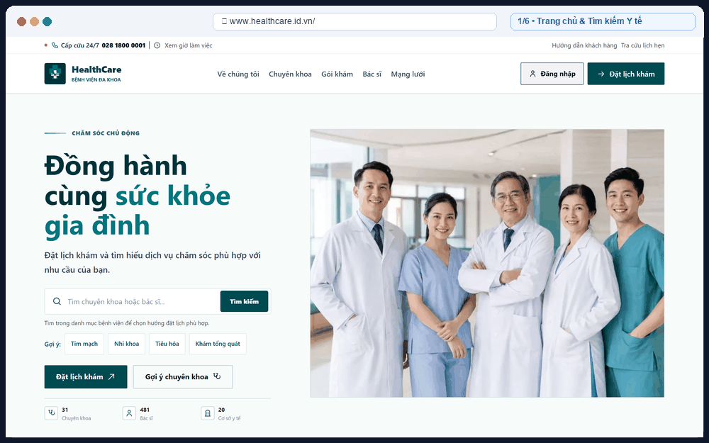
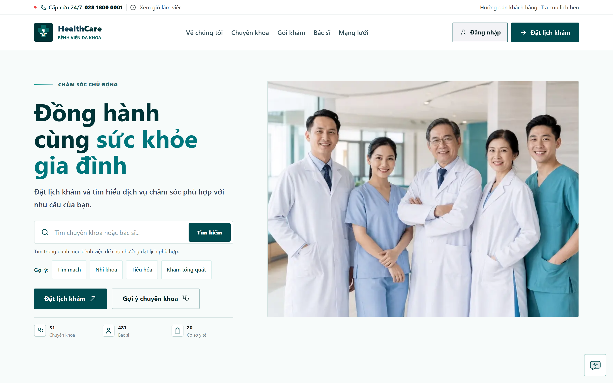
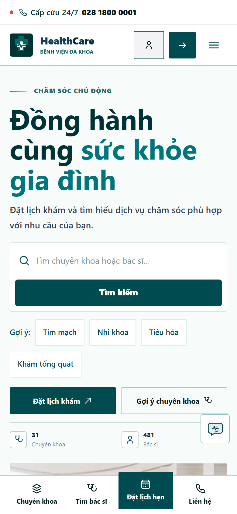
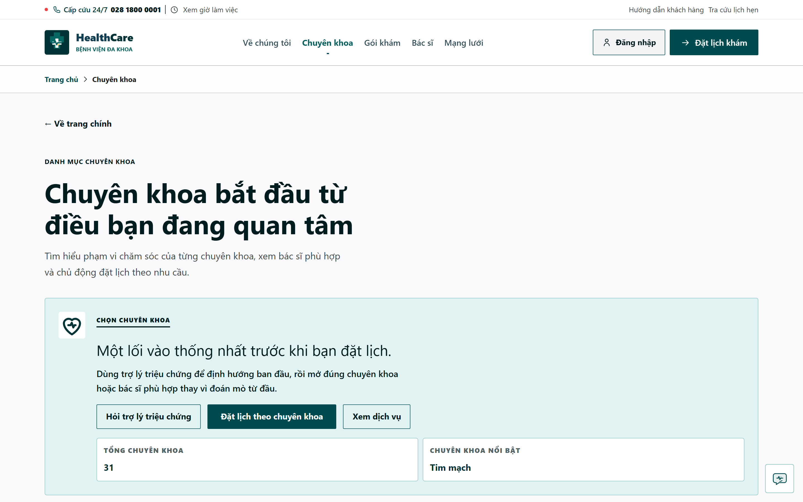
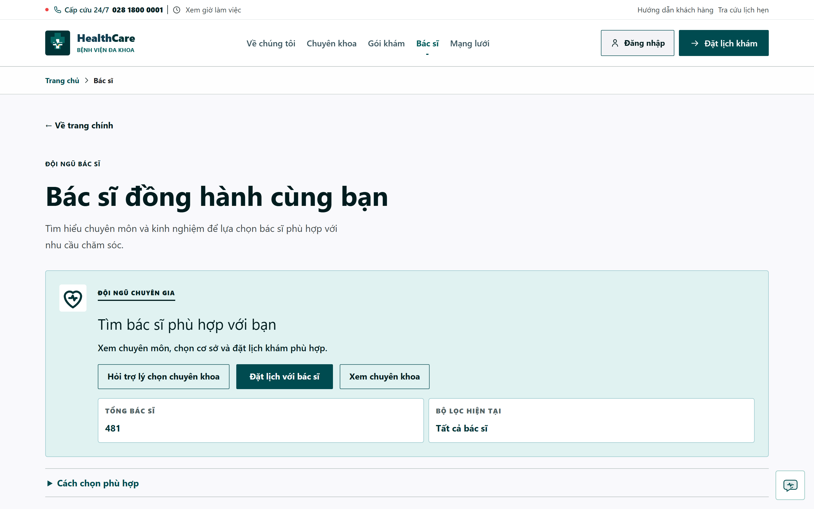
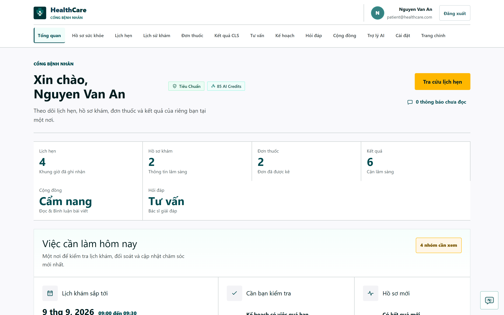
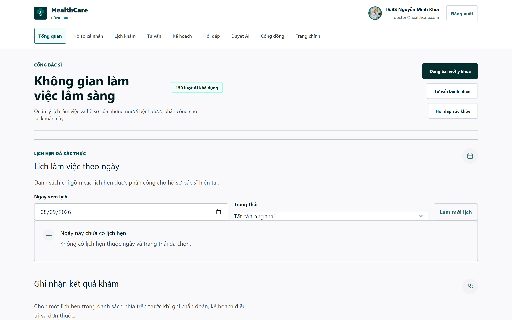
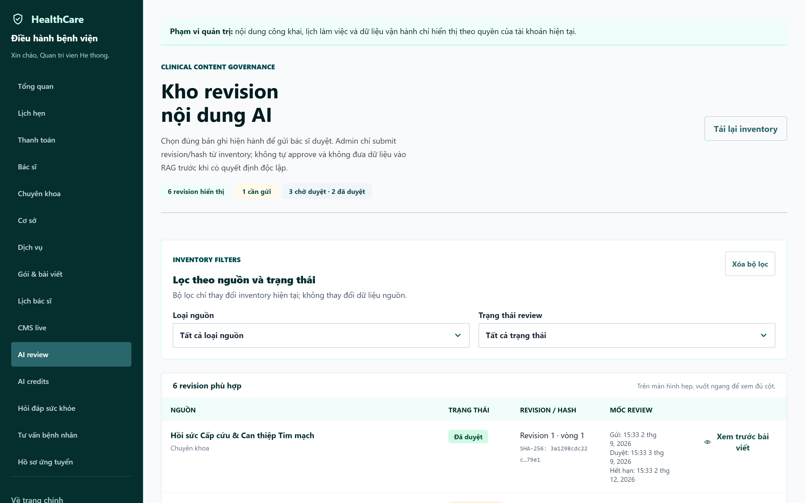
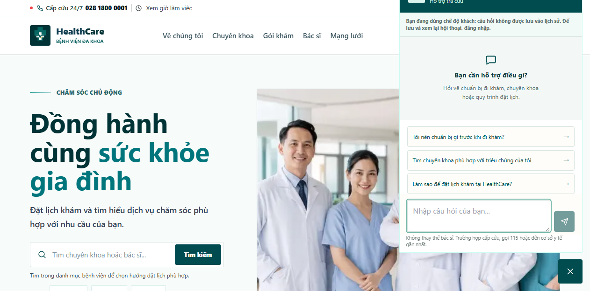

<div align="center">

# HealthCare Project
### Nền Tảng Y Tế Số Toàn Diện • Hệ Thống Quản Trị Bệnh Viện Thông Minh
**Next-Generation Hospital Management, Branch-Aware Clinical Booking & AI-Assisted Medical Triage**

[](https://www.healthcare.id.vn)
[](https://healthcare-two-olive.vercel.app)
[](https://nextjs.org)
[](https://spring.io/projects/spring-boot)
[](https://fastapi.tiangolo.com)
[](https://www.postgresql.org)
[](https://www.docker.com)
[](LICENSE)

<p align="center">
  <a href="#demo-trực-tiếp--tài-khoản-trải-nghiệm-live-demo--roles"><strong>Trải nghiệm Demo</strong></a> •
  <a href="#product-walkthrough-demo"><strong>Ảnh động Demo (GIF)</strong></a> •
  <a href="#kiến-trúc-hệ-thống-system-architecture"><strong>Sơ đồ Kiến trúc</strong></a> •
  <a href="#bộ-sưu-tập-giao-diện-thực-tế-screenshots-gallery"><strong>Ảnh Giao diện Thực tế</strong></a> •
  <a href="#tính-năng-cốt-lõi-features-matrix"><strong>Tính năng Cốt lõi</strong></a> •
  <a href="#hướng-dẫn-cài-đặt--khởi-động-nhanh-quick-start"><strong>Cài đặt Cục bộ</strong></a>
</p>

</div>

---

## Product Walkthrough Demo

> *Ảnh động minh họa toàn bộ hành trình trải nghiệm hệ sinh thái y tế số HealthCare: từ tra cứu chuyên khoa, tìm kiếm bác sĩ, kích hoạt trợ lý AI y tế (RAG), đến quản lý cổng bệnh nhân, studio lâm sàng bác sĩ và bảng điều khiển quản trị viện.*

<div align="center">
  
</div>

---

## Demo Trực Tiếp & Tài Khoản Trải Nghiệm (Live Demo & Roles)

Hệ thống đã được thiết lập sẵn phân quyền người dùng theo vai trò (RBAC) trên môi trường trực tiếp. Bạn có thể đăng nhập vào cổng tương ứng để trải nghiệm trọn vẹn nghiệp vụ lâm sàng và quản trị:

**Cổng Đăng Nhập Trực Tiếp**: [https://www.healthcare.id.vn/auth/login](https://www.healthcare.id.vn/auth/login) *(hoặc domain dự phòng [healthcare-two-olive.vercel.app](https://healthcare-two-olive.vercel.app/auth/login))*

| Vai trò (Role) | Tài khoản Đăng nhập | Mật khẩu | Portal Phục vụ | Phạm vi Quyền hạn & Nghiệp vụ Trọng tâm |
| :--- | :--- | :--- | :--- | :--- |
| **Quản trị viên (ADMIN)** | `admin@healthcare.com` | `HealthCare@2026` | [`/admin`](https://www.healthcare.id.vn/admin) | Quản trị toàn viện: Quản lý danh mục bác sĩ, chuyên khoa, chi nhánh cơ sở, khung giờ khám, phê duyệt nội dung AI & kiểm duyệt câu hỏi y tế |
| **Bác sĩ (DOCTOR)** | `doctor@healthcare.com` | `HealthCare@2026` | [`/doctor`](https://www.healthcare.id.vn/doctor) | Cổng lâm sàng (BS. Lê Quốc Hà - Chấn thương chỉnh hình): Tiếp nhận hàng đợi khám trong ngày, xuất kết quả chẩn đoán, toa thuốc điện tử & bài viết chuyên môn |
| **Bệnh nhân (PATIENT)** | `patient@healthcare.com` | `HealthCare@2026` | [`/patient`](https://www.healthcare.id.vn/patient) | Cổng bệnh nhân (Nguyễn Văn An): Xem lịch sử hẹn khám, kết quả chẩn đoán, tải hồ sơ sức khỏe và trò chuyện cùng Trợ lý AI Y tế (RAG) |

> [!TIP]
> **Cơ chế Điều Hướng Thông Minh**: Sau khi nhập thông tin đăng nhập, hệ thống tự động phân tích vai trò trong JWT Claims và chuyển hướng chính xác đến bảng điều khiển tương ứng (`/admin`, `/doctor` hoặc `/patient`).

---

## Kiến trúc Hệ thống (System Architecture)

Kiến trúc **HealthCare Project** tuân thủ các chuẩn mực thiết kế phân lớp doanh nghiệp (Enterprise Tiered Architecture), phân tách độc lập giữa cổng biên Vercel Edge, lớp ứng dụng lõi Spring Boot & FastAPI AI trên nền tảng đám mây Render, cùng ngăn xếp lưu trữ dữ liệu an toàn PostgreSQL, Redis, MinIO và Supabase RLS.

### Sơ đồ Kiến trúc Xuất bản (High-Resolution Diagram)

<div align="center">
  <a href="docs/assets/architecture.svg">
    
  </a>
  <p><em>Sơ đồ Kiến trúc Hệ thống HealthCare (Chuẩn đồ họa công bố 2026). Nhấp vào hình để mở tệp SVG vector nguyên bản.</em></p>
</div>

> **Tài sản sơ đồ**:
> - Định dạng đồ họa vector SVG sắc nét: [`docs/assets/architecture.svg`](docs/assets/architecture.svg)
> - Định dạng ảnh siêu nét Retina 2K (2880×1960): [`docs/assets/architecture.png`](docs/assets/architecture.png)
> - Tài liệu phân tích kỹ thuật chi tiết: [`docs/architecture/system-overview.md`](docs/architecture/system-overview.md)

---

### Sơ đồ Mermaid.js v11 (Interactive Flowchart)

```mermaid
flowchart TD
    %% Theme & Styling Declarations
    classDef client fill:#EFF6FF,stroke:#3B82F6,stroke-width:1.5px,color:#1E3A8A;
    classDef edge fill:#ECFDF5,stroke:#10B981,stroke-width:1.5px,color:#065F46;
    classDef backend fill:#EEF2FF,stroke:#6366F1,stroke-width:1.5px,color:#312E81;
    classDef ai fill:#FAF5FF,stroke:#A855F7,stroke-width:1.5px,color:#581C87;
    classDef data fill:#FFFBEB,stroke:#F59E0B,stroke-width:1.5px,color:#78350F;
    classDef ops fill:#F8FAFC,stroke:#64748B,stroke-width:1.5px,color:#1E293B;

    %% LAYER 1: CLIENT & USER INTERFACES
    subgraph ClientLayer["LAYER 1: CLIENT & USER INTERFACES"]
        Users["Multi-role Users\n(Patients • Doctors • Admins)"]:::client
        NextFrontend["Next.js 16 Web Portal\n(React 19, App Router, Turbopack, TailwindCSS)"]:::client
        PatientPortal["Patient Hub\n(/patient)"]:::client
        DoctorPortal["Doctor Clinical Studio\n(/doctor)"]:::client
        AdminPortal["Admin CMS & QA Moderation\n(/admin)"]:::client
        MobilePWA["Responsive Mobile PWA\n(390px-1440px Zero Layout Shift)"]:::client
    end

    %% LAYER 2: GATEWAY & VERCEL EDGE
    subgraph EdgeLayer["LAYER 2: GATEWAY & VERCEL EDGE NETWORK"]
        CustomDomain["Custom Domain & Anycast CDN\nwww.healthcare.id.vn (SSL/TLS 1.3)"]:::edge
        EdgeSecurity["Edge Security & CORS Guard\n(BFF Origin Guard, 403 Untrusted Rejection)"]:::edge
        BFFProxy["Next.js Route Handlers / BFF Proxy\n(/api/v1/* & /api/ai/chat SSE Stream)"]:::edge
    end

    %% LAYER 3: APPLICATION SERVICES (RENDER CLOUD)
    subgraph ServiceLayer["LAYER 3: APPLICATION SERVICES (RENDER CLOUD)"]
        subgraph BackendMono["Core Backend Service (Spring Boot 3.3.x, Java 21)"]
            SpringSec["Spring Security 6\n(JWT Stateless Auth, RBAC, Bounded OTP)"]:::backend
            CatalogAPI["Hospital Catalog & Doctors API\n(Specialties, Branches, Packages)"]:::backend
            BookingEngine["Booking & Appointment Lifecycle\n(Concurrency Lock & Rescheduling)"]:::backend
            ClinicalRecords["Clinical Records & Diagnostic Files\n(Presigned URLs & Role Isolation)"]:::backend
            PaymentReconcile["Bank Transfer Reconciliation\n(Automated Payment Verification)"]:::backend
            RealtimeSSE["WebSocket / SSE Notification Stream\n(CMS & Booking Realtime Updates)"]:::backend
        end

        subgraph AIService["AI & RAG Intelligence Service (FastAPI, Python 3.12)"]
            TriageEngine["Medical Symptom Intake & Triage\n(Structured Symptom Classifier)"]:::ai
            RAGPipeline["RAG Pipeline & Vector Search\n(Hospital Guidelines & Protocols)"]:::ai
            SafetyGuard["Medical Safety Guardrails\n(Prompt Injection Defense & Privacy Shield)"]:::ai
            FallbackProvider["Fail-Closed Provider Fallback\n(Local Deterministic Rule + Cloud LLM)"]:::ai
        end
    end

    %% LAYER 4: DATA PERSISTENCE & STORAGE
    subgraph DataLayer["LAYER 4: DATA PERSISTENCE & STORAGE STACK"]
        PostgresDB[("PostgreSQL 16 (Primary DB)\nFlyway Migrations (V1..V8 Schema)\nTransactional Catalog & Appointments")]:::data
        RedisCache[("Redis / Key-Value Cache\nSliding Window Rate Limit & Session Tokens")]:::data
        MinIOStorage[("MinIO / S3 Object Storage\nEncrypted Medical Scans & Lab Results")]:::data
        SupabaseSync[("Supabase Audited Boundary\nHealthcare Schema + RLS Projections")]:::data
    end

    %% LAYER 5: DEVOPS & OPERATIONS
    subgraph OpsLayer["LAYER 5: DEVOPS, SECURITY & OPERATIONS"]
        GithubCI["GitHub Actions Enterprise CI/CD\n(Lint, Typecheck, Multi-arch Docker, SBOM)"]:::ops
        ClamAVScan["ClamAV Antivirus Scanner\n(Attachment Scan Quarantine Pipe)"]:::ops
        MailpitSink["Mailpit SMTP Dev Sink\n(Transactional Email & OTP Testing)"]:::ops
    end

    %% DATA FLOW CONNECTORS
    Users -->|HTTPS / Browsing| NextFrontend
    NextFrontend --> PatientPortal & DoctorPortal & AdminPortal & MobilePWA
    NextFrontend -->|Web Request| CustomDomain
    CustomDomain --> EdgeSecurity
    EdgeSecurity -->|Validated Origin| BFFProxy

    BFFProxy -->|Server-side Token Auth (REST)| SpringSec
    BFFProxy -->|Streaming SSE Query| TriageEngine

    SpringSec --> CatalogAPI & BookingEngine & ClinicalRecords & PaymentReconcile & RealtimeSSE
    BookingEngine -->|Internal HTTP Triage| AIService

    CatalogAPI & BookingEngine & PaymentReconcile -->|JDBC Transactions| PostgresDB
    SpringSec & EdgeSecurity -->|Rate-limit Tokens| RedisCache
    ClinicalRecords -->|S3 Presigned URLs| MinIOStorage
    MinIOStorage -.->|Async Virus Inspection| ClamAVScan
    PostgresDB -.->|Audited RLS Sync| SupabaseSync

    GithubCI -.->|Automated Verification| NextFrontend & BackendMono & AIService
    BackendMono -.->|Development Email Sink| MailpitSink
```

---

## Bộ Sưu Tập Giao Diện Thực Tế (Screenshots Gallery)

Dưới đây là các hình ảnh chụp thực tế từ hệ thống trên các thiết bị và cổng phân quyền khác nhau:

### 1. Trang Chủ & Trải Nghiệm Khám Phá (Desktop & Mobile)

| Giao diện Desktop Trang chủ (`2880 × 1800`) | Giao diện Mobile Responsive PWA (`780 × 1688`) |
| :---: | :---: |
| [](docs/assets/screenshots/01-desktop-homepage.png) | [](docs/assets/screenshots/05-mobile-responsive.png) |
| *Tìm kiếm chuyên khoa, bác sĩ & bảng tin y tế* | *Tối ưu hóa cảm ứng, 100% không vỡ layout trên mobile* |

### 2. Danh Mục Chuyên Khoa & Danh Bạ Bác Sĩ

| Danh mục Chuyên khoa Y tế | Danh bạ Bác sĩ & Đặt lịch |
| :---: | :---: |
| [](docs/assets/screenshots/06-specialties-catalog.png) | [](docs/assets/screenshots/07-doctors-directory.png) |
| *30+ chuyên khoa khám và dịch vụ cận lâm sàng* | *Thông tin chuyên gia, lịch trực chi nhánh & số năm kinh nghiệm* |

### 3. Cổng Bệnh Nhân & Cổng Lâm Sàng Bác Sĩ

| Cổng Bệnh nhân (Patient Hub) | Cổng Bác sĩ (Doctor Clinical Studio) |
| :---: | :---: |
| [](docs/assets/screenshots/02-patient-hub.png) | [](docs/assets/screenshots/03-doctor-clinical-dashboard.png) |
| *Xem lịch khám, kết quả chẩn đoán & đơn thuốc điện tử* | *Tiếp nhận lịch khám, ghi nhận bệnh án & viết bài chuyên môn* |

### 4. Quản Trị Viện & Trợ Lý Y Tế AI (RAG)

| Quản trị Viện & Kiểm duyệt AI | Trợ lý Y tế Trí tuệ Nhân tạo (RAG) |
| :---: | :---: |
| [](docs/assets/screenshots/04-admin-ai-governance.png) | [](docs/assets/screenshots/08-ai-medical-assistant.png) |
| *Bảng kiểm duyệt câu hỏi AI, quản lý danh mục toàn viện* | *Phân luồng triệu chứng, tra cứu phác đồ y khoa an toàn* |

---

## Tính Năng Cốt Lõi (Features Matrix)

### 1. Nghiệp vụ Khám Chữa Bệnh & Đặt Lịch (Clinical & Scheduling)
- **Đặt lịch phân luồng chi nhánh**: Chọn bệnh viện/cơ sở gần nhất, lựa chọn chuyên khoa và bác sĩ phụ trách.
- **Khóa chỗ chống xung đột (Pessimistic Locking)**: Kiểm soát chặt chẽ khung giờ khám (slots), đảm bảo 2 bệnh nhân không thể cùng đặt 1 khung giờ.
- **Vòng đời cuộc hẹn hoàn chỉnh**: Đặt lịch -> Xác nhận qua OTP/Email -> Tiếp nhận -> Khám bệnh -> Xuất bệnh án & Đơn thuốc.
- **Hồ sơ lâm sàng điện tử**: Lưu trữ kết quả chẩn đoán, phiếu xét nghiệm hình ảnh với chữ ký số và phân quyền bảo mật cao.

### 2. Trợ Lý AI Y Tế & RAG Tri thức (Medical AI & Safety Guardrails)
- **Tiếp nhận & phân luồng triệu chứng (Triage)**: Phân tích mô tả của người bệnh, gợi ý chuyên khoa phù hợp và phát hiện dấu hiệu cấp cứu y tế.
- **Kiến trúc RAG (Retrieval-Augmented Generation)**: Truy vấn dựa trên tài liệu y khoa chuẩn mực đã được thẩm định, trả lời có trích dẫn nguồn tin cậy.
- **Lưới bảo vệ an toàn (Safety Guardrails)**:
  - *Chống can thiệp prompt (Prompt Injection Defense)*: Tự động vô hiệu hóa các câu lệnh phá hoại ngữ cảnh.
  - *Bảo mật thông tin bệnh nhân*: Tuyệt đối từ chối xuất danh sách hoặc thông tin cá nhân của bệnh nhân khác (`REFUSE`).
  - *Dự phòng đóng an toàn (Fail-closed)*: Luôn có bộ quy tắc xử lý cục bộ an toàn khi dịch vụ bên thứ ba mất kết nối.

### 3. Bảo Mật Cấp Doanh Nghiệp (Enterprise Security)
- **BFF (Backend-For-Frontend) Architecture**: Ẩn danh hoàn toàn mạng backend; xác thực giữa Next.js và Spring Boot thông qua server-side token bí mật.
- **Origin Guard**: Từ chối các request lạ không đến từ domain chính thức (`403 BFF_ORIGIN_INVALID`).
- **Quét mã độc ClamAV**: Tự động rà soát toàn bộ tệp tin chẩn đoán hình ảnh và tài liệu bệnh nhân trước khi lưu trữ vĩnh viễn.
- **Kiểm soát truy cập cấp hàng (Row-Level Security - RLS)**: Bảo vệ dữ liệu người dùng ở cấp độ cơ sở dữ liệu.

---

## Ngăn Xếp Công Nghệ (Tech Stack Overview)

```text
HealthCare_Project Monorepo
├── Frontend:        Next.js 16.3.3 (App Router) • React 19.2.8 • TailwindCSS 3.4 • TypeScript 6.0
├── Backend Core:     Spring Boot 3.3.x (Java 21) • Spring Security 6 • Hibernate • Flyway
├── AI Service:       FastAPI (Python 3.12) • LangChain / RAG Pipeline • Vector Search • Pytest
├── Database:        PostgreSQL 16 • Redis / Render Key-Value • Supabase RLS
├── Storage:         MinIO S3 Compatible Object Storage • ClamAV Scanner
├── Edge & Hosting:  Vercel Edge Network (Domain www.healthcare.id.vn) • Render Cloud Containers
└── DevOps & CI/CD:  GitHub Actions • Docker Compose (9 Services) • Playwright E2E
```

---

## Hướng Dẫn Cài Đặt & Khởi Động Nhanh (Quick Start)

### 1. Yêu cầu Môi trường (Prerequisites)
- **Docker Desktop** (khuyến nghị phiên bản mới nhất trên Windows/macOS/Linux)
- **Node.js** `>= 22` và **npm** `>= 10`
- **Java** `21` (JDK) và **Maven** `>= 3.9`
- **Python** `>= 3.12`

### 2. Khởi chạy Toàn bộ Hệ thống bằng Docker Compose (Khuyên dùng)
Chỉ với 1 câu lệnh, toàn bộ 9 container dịch vụ (Frontend, Backend, AI, PostgreSQL, Redis, MinIO, Mailpit, ClamAV) sẽ được khởi chạy đồng bộ:

```bash
# 1. Clone repository
git clone https://github.com/JasonTM17/HealthCare_Project.git
cd HealthCare_Project

# 2. Tạo tệp môi trường từ bản mẫu
cp .env.example .env

# 3. Khởi chạy toàn bộ 9 dịch vụ với Docker Compose
docker compose --env-file .env -f infrastructure/docker-compose.yml up -d
```

Sau khi các container đạt trạng thái `healthy`:
- **Web Frontend**: [http://localhost:3000](http://localhost:3000)
- **Spring Boot API**: [http://localhost:8080/actuator/health](http://localhost:8080/actuator/health)
- **FastAPI AI Service**: [http://localhost:8000/livez](http://localhost:8000/livez)
- **MinIO Console**: [http://localhost:9001](http://localhost:9001) *(User/Pass: `minioadmin` / `minioadmin`)*
- **Mailpit Web UI**: [http://localhost:8025](http://localhost:8025)

---

### 3. Khởi chạy Từng Phân Hệ để Phát Triển (Local Development)

#### Chạy Backend (Spring Boot 3)
```bash
cd apps/backend
./mvnw clean test
./mvnw spring-boot:run -Dspring-boot.run.profiles=local
```

#### Chạy Frontend (Next.js 16)
```bash
cd apps/frontend
npm ci
npm run dev
```

#### Chạy AI Service (FastAPI)
```bash
cd apps/ai-service
python -m venv .venv
# Trên Windows: .venv\Scripts\activate | Trên Linux/macOS: source .venv/bin/activate
pip install -r requirements.txt
uvicorn app.main:app --reload --port 8000
```

---

## Chiến Lược Kiểm Thử & CI/CD Pipeline (Testing & Verification)

Hệ thống được bảo vệ bởi mạng lưới kiểm thử tự động đa tầng (Multi-layer Testing Pipeline):

```text
┌───────────────────────────────────────────────────────────────────────────────────┐
│                           GitHub Actions CI/CD Pipeline                           │
├───────────────────┼───────────────────┼───────────────────┼───────────────────────┤
│    apps/frontend  │   apps/backend    │  apps/ai-service  │     E2E & Compose     │
├───────────────────┼───────────────────┼───────────────────┼───────────────────────┤
│ • ESLint 9        │ • JUnit 5 (528)   │ • Pytest (427)    │ • Playwright E2E      │
│ • TypeScript tsc  │ • Integration DB  │ • Ruff Linter     │ • BFF Chat Canary     │
│ • Unit & BFF (268)│ • Security RBAC   │ • Mypy Typecheck  │ • Multi-arch Docker   │
│ • Next.js Build   │ • Flyway Validate │ • Adversarial RAG │ • SBOM & Provenance   │
└───────────────────┴───────────────────┴───────────────────┴───────────────────────┘
```

Chạy kiểm tra xác thực nhanh cục bộ trước khi tạo Pull Request:
```bash
# Kiểm tra Frontend
cd apps/frontend && npm run verify

# Kiểm tra Backend
cd apps/backend && ./mvnw test

# Kiểm tra AI Service
cd apps/ai-service && python -m pytest && ruff check . && mypy
```

---

## Nhật Ký Bản Phát Hành & Bản Ghi Bảo Mật (Release Records)

<details>
<summary><strong>Nhấp vào đây để xem chi tiết bản ghi bảo mật và SHA phát hành đã thẩm định</strong></summary>

### Trạng thái Production Vercel (2026-09-08)
- **Deployment ID**: `dpl_7LBTguGVawqJdR6v6AFyXzMH6uwU` (READY/PROMOTED)
- **Commit SHA**: `5d104d974221cddd4cdd19a54ddfbf11b596cae2`
- **Domain phục vụ**: `www.healthcare.id.vn` & `healthcare-two-olive.vercel.app`
- **Kiểm thử canary**: `/`, `/specialties`, `/api/v1/health` đều trả về HTTP 200; BFF Origin Guard chặn truy cập không hợp lệ với mã `403 BFF_ORIGIN_INVALID`.

### Trạng thái Render Free Backend & AI (2026-09-02)
- **Backend Build**: Source `bbecb296dd2dcd8864ab7a37b9f67d36f8b206dc` với xử lý chuẩn `NoResourceFoundException` 404 thay vì lỗi generic 500.
- **AI Service Deploy**: `dep-dab5l5favr4c73esg3eg` tích hợp bộ lọc an toàn ngôn ngữ kép (Tiếng Việt & Tiếng Anh).

### Gói Container Bất biến (GHCR Packages with SBOM & Provenance)
| GHCR Package | Digest Bất biến | Trạng thái Thẩm định |
| :--- | :--- | :--- |
| [backend](https://github.com/JasonTM17/HealthCare_Project/pkgs/container/healthcare-project-backend) | `ghcr.io/jasontm17/healthcare-project-backend@sha256:45b0bb679588ba7a6eb075a4dd867ed4b11c92fc42485ee94759d0f7c4f889d6` | Passed CI & Attestation |
| [ai-service](https://github.com/JasonTM17/HealthCare_Project/pkgs/container/healthcare-project-ai-service) | `ghcr.io/jasontm17/healthcare-project-ai-service@sha256:3b60b36b6ce9773d2d127431bc8ae9de82430bfac955df100c0ea63797f7eaf1` | Passed CI & Attestation |
| [frontend](https://github.com/JasonTM17/HealthCare_Project/pkgs/container/healthcare-project-frontend) | `ghcr.io/jasontm17/healthcare-project-frontend@sha256:adff5f320ebde59653531759489d1e21d1b5f25cbd7799c81ceec4a2ae674826` | Passed CI & Attestation |
| [attachment-scanner](https://github.com/JasonTM17/HealthCare_Project/pkgs/container/healthcare-project-attachment-scanner) | `ghcr.io/jasontm17/healthcare-project-attachment-scanner@sha256:367a080e61505c8bd98086c6499e56fa7e6bf0e44c92a567016bf32fac6e06f5` | Passed CI & Attestation |

</details>

---

## Giới Hạn Phạm Vi & Tuyên Bố Trách Nhiệm (Scope & Disclaimer)

> [!WARNING]
> **Dự án Nghiên cứu & Giáo dục (Educational MVP)**:
> Dự án này được xây dựng nhằm mục đích nghiên cứu công nghệ và thử nghiệm kiến trúc phần mềm y tế thông minh. Mã nguồn không cấu thành một thiết bị y tế được chứng nhận và không thể thay thế lời khuyên, chẩn đoán hay điều trị y khoa trực tiếp từ bác sĩ chuyên môn. Để triển khai thực tế tại bệnh viện, hệ thống cần bổ sung các chứng nhận an toàn y tế, quy trình sao lưu khôi phục thảm họa (Disaster Recovery), thẩm định quyền riêng tư người bệnh (HIPAA / GDPR / Nghị định 13/2023/NĐ-CP) và hợp đồng dịch vụ SLA chính thức.

---

<div align="center">
  <p>Được phát triển với niềm đam mê nâng cao trải nghiệm y tế số • Bản quyền © 2026 HealthCare Project.</p>
</div>
