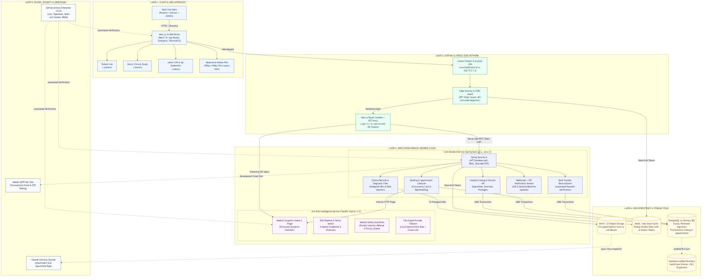

# HealthCare System Architecture & Technical Specifications

Tài liệu này mô tả toàn diện kiến trúc kỹ thuật hệ sinh thái **HealthCare Project** — nền tảng y tế số toàn diện theo tiêu chuẩn bệnh viện thông minh (Smart Hospital Platform).

---

## Sơ đồ Kiến trúc Hệ thống Tổng thể (System Architecture)

Sơ đồ dưới đây minh họa sự kết nối giữa các tầng: từ giao diện người dùng (Client / Next.js 16), cổng biên (Vercel Edge & BFF Gateway), các cụm dịch vụ ứng dụng (Spring Boot 3 & FastAPI AI Service) cho tới tầng lưu trữ dữ liệu (PostgreSQL, Redis, MinIO, Supabase) và quy trình vận hành CI/CD.

> **Tệp nguồn đồ họa xuất bản**:
> - Định dạng đồ họa vector chất lượng cao: [`docs/assets/architecture.svg`](../assets/architecture.svg)
> - Định dạng ảnh siêu nét Retina 2K (2880x1960): [`docs/assets/architecture.png`](../assets/architecture.png)
> - Định dạng Mermaid v11 nguyên bản: [`system-overview.mmd`](system-overview.mmd)

---

## Sơ đồ Mermaid.js v11 (Interactive Specification)

```mermaid
flowchart TD
    %% Theme & Styling Declarations
    classDef client fill:#EFF6FF,stroke:#3B82F6,stroke-width:1.5px,color:#1E3A8A;
    classDef edge fill:#ECFDF5,stroke:#10B981,stroke-width:1.5px,color:#065F46;
    classDef backend fill:#EEF2FF,stroke:#6366F1,stroke-width:1.5px,color:#312E81;
    classDef ai fill:#FAF5FF,stroke:#A855F7,stroke-width:1.5px,color:#581C87;
    classDef data fill:#FFFBEB,stroke:#F59E0B,stroke-width:1.5px,color:#78350F;
    classDef ops fill:#F8FAFC,stroke:#64748B,stroke-width:1.5px,color:#1E293B;

    %% -------------------------------------------------------------
    %% LAYER 1: CLIENT & USER CHANNELS
    %% -------------------------------------------------------------
    subgraph ClientLayer["LAYER 1: CLIENT & USER INTERFACES"]
        Users["Multi-role Users<br/>(Patients • Doctors • Admins)"]:::client
        NextFrontend["Next.js 16 Web Portal<br/>(React 19, App Router, Turbopack, TailwindCSS)"]:::client
        PatientPortal["Patient Hub<br/>(/patient)"]:::client
        DoctorPortal["Doctor Clinical Studio<br/>(/doctor)"]:::client
        AdminPortal["Admin CMS & QA Moderation<br/>(/admin)"]:::client
        MobilePWA["Responsive Mobile PWA<br/>(390px-1440px Zero Layout Shift)"]:::client
    end

    %% -------------------------------------------------------------
    %% LAYER 2: GATEWAY & VERCEL EDGE
    %% -------------------------------------------------------------
    subgraph EdgeLayer["LAYER 2: GATEWAY & VERCEL EDGE NETWORK"]
        CustomDomain["Custom Domain & Anycast CDN<br/>www.healthcare.id.vn (SSL/TLS 1.3)"]:::edge
        EdgeSecurity["Edge Security & CORS Guard<br/>(BFF Origin Guard, 403 Untrusted Rejection)"]:::edge
        BFFProxy["Next.js Route Handlers / BFF Proxy<br/>(/api/v1/* & /api/ai/chat SSE Stream)"]:::edge
    end

    %% -------------------------------------------------------------
    %% LAYER 3: APPLICATION SERVICES (RENDER CLOUD CONTAINERS)
    %% -------------------------------------------------------------
    subgraph ServiceLayer["LAYER 3: APPLICATION SERVICES (RENDER CLOUD)"]
        subgraph BackendMono["Core Backend Service (Spring Boot 3.5.x, Java 21)"]
            SpringSec["Spring Security 6<br/>(JWT Stateless Auth, RBAC, Bounded OTP)"]:::backend
            CatalogAPI["Hospital Catalog & Doctors API<br/>(Specialties, Branches, Packages)"]:::backend
            BookingEngine["Booking & Appointment Lifecycle<br/>(Concurrency Lock & Rescheduling)"]:::backend
            ClinicalRecords["Clinical Records & Diagnostic Files<br/>(Presigned URLs & Role Isolation)"]:::backend
            PaymentReconcile["Bank Transfer Reconciliation<br/>(Automated Payment Verification)"]:::backend
            RealtimeSSE["WebSocket / SSE Notification Stream<br/>(CMS & Booking Realtime Updates)"]:::backend
        end

        subgraph AIService["AI & RAG Intelligence Service (FastAPI, Python 3.12)"]
            TriageEngine["Medical Symptom Intake & Triage<br/>(Structured Symptom Classifier)"]:::ai
            RAGPipeline["RAG Pipeline & Vector Search<br/>(Hospital Guidelines & Protocols)"]:::ai
            SafetyGuard["Medical Safety Guardrails<br/>(Prompt Injection Defense & Privacy Shield)"]:::ai
            FallbackProvider["Fail-Closed Provider Fallback<br/>(Local Deterministic Rule + Cloud LLM)"]:::ai
        end
    end

    %% -------------------------------------------------------------
    %% LAYER 4: DATA PERSISTENCE & STORAGE
    %% -------------------------------------------------------------
    subgraph DataLayer["LAYER 4: DATA PERSISTENCE & STORAGE STACK"]
        PostgresDB[("PostgreSQL 16 (Primary DB)<br/>Flyway Versioned Migrations<br/>Transactional Catalog & Appointments")]:::data
        RedisCache[("Redis / Key-Value Cache<br/>Sliding Window Rate Limit & Session Tokens")]:::data
        MinIOStorage[("MinIO / S3 Object Storage<br/>Encrypted Medical Scans & Lab Results")]:::data
        SupabaseSync[("Supabase Audited Boundary<br/>Healthcare Schema + RLS Projections")]:::data
    end

    %% -------------------------------------------------------------
    %% LAYER 5: DEVOPS, SECURITY & CI/CD
    %% -------------------------------------------------------------
    subgraph OpsLayer["LAYER 5: DEVOPS, SECURITY & OPERATIONS"]
        GithubCI["GitHub Actions Enterprise CI/CD<br/>(Lint, Typecheck, Multi-arch Docker, SBOM)"]:::ops
        ClamAVScan["ClamAV Antivirus Scanner<br/>(Attachment Scan Quarantine Pipe)"]:::ops
        MailpitSink["Mailpit SMTP Dev Sink<br/>(Transactional Email & OTP Testing)"]:::ops
    end

    %% -------------------------------------------------------------
    %% FLOW ARROWS & DATA PATHS
    %% -------------------------------------------------------------
    Users -->|HTTPS / Browsing| NextFrontend
    NextFrontend --> PatientPortal
    NextFrontend --> DoctorPortal
    NextFrontend --> AdminPortal
    NextFrontend --> MobilePWA
    NextFrontend -->|Web Request| CustomDomain
    CustomDomain --> EdgeSecurity
    EdgeSecurity -->|Validated Origin| BFFProxy

    BFFProxy -->|Server-side REST Token Auth| SpringSec
    BFFProxy -->|Streaming SSE Query| TriageEngine

    SpringSec --> CatalogAPI
    SpringSec --> BookingEngine
    SpringSec --> ClinicalRecords
    SpringSec --> PaymentReconcile
    SpringSec --> RealtimeSSE

    BookingEngine -->|Internal HTTP Triage| TriageEngine

    CatalogAPI -->|JDBC Transactions| PostgresDB
    BookingEngine -->|JDBC Transactions| PostgresDB
    PaymentReconcile -->|JDBC Transactions| PostgresDB

    SpringSec -->|Rate-limit Tokens| RedisCache
    EdgeSecurity -->|Rate-limit Tokens| RedisCache

    ClinicalRecords -->|S3 Presigned URLs| MinIOStorage
    MinIOStorage -.->|Async Virus Inspection| ClamAVScan
    PostgresDB -.->|Audited RLS Sync| SupabaseSync

    GithubCI -.->|Automated Verification| NextFrontend
    GithubCI -.->|Automated Verification| SpringSec
    GithubCI -.->|Automated Verification| TriageEngine
    SpringSec -.->|Development Email Sink| MailpitSink
```

---

## Chi tiết Kỹ thuật Các Tầng Kiến trúc (Layer-by-Layer Breakdown)

### 1. Tầng Client & Frontend (Next.js 16 + React 19)
- **Kiến trúc App Router & Server Components**: Tối ưu hóa tải trang lần đầu (FCP < 0.8s) bằng Server Components rendering; Client Components chỉ dùng cho tương tác người dùng (đặt lịch, chat AI, upload ảnh).
- **Trải nghiệm Responsive & PWA**: Hỗ trợ giao diện linh hoạt từ màn hình điện thoại (390px) đến màn hình Retina 4K không bị giật layout (CLS = 0).
- **Phân hệ Portals chuyên biệt**:
  - `/patient`: Cổng bệnh nhân tra cứu lịch khám, kết quả chẩn đoán, toa thuốc điện tử và phiên tư vấn y tế.
  - `/doctor`: Cổng bác sĩ quản lý lịch trực, hàng đợi khám bệnh nhân, xuất kết quả lâm sàng và bài viết y khoa chuyên ngành.
  - `/admin`: Cổng quản trị viện quản lý danh mục bác sĩ, khoa phòng, ca khám, phê duyệt nội dung AI & kiểm duyệt câu trả lời y tế.

### 2. Tầng Gateway & Vercel Edge Network
- **Custom Domain & SSL**: Phục vụ chính thức tại `www.healthcare.id.vn` với Anycast CDN toàn cầu, chứng chỉ SSL/TLS 1.3 tự động gia hạn.
- **BFF (Backend-For-Frontend) Proxy**: Các yêu cầu từ trình duyệt được gửi qua Route Handlers `/api/v1/*` của Next.js. BFF chịu trách nhiệm chèn token bảo mật server-side, ẩn hoàn toàn địa chỉ IP và cổng dịch vụ nội bộ của backend.
- **Origin Guard & Chống DDoS**: Kiểm tra header `Origin` nghiêm ngặt; từ chối mọi yêu cầu từ các domain lạ (`403 BFF_ORIGIN_INVALID`), đồng thời áp dụng rate-limiting chống quét tự động.

### 3. Tầng Dịch vụ Backend (Spring Boot 3.5.x, Java 21)
- **Mô hình Modular Monolith**: Đóng gói các module nghiệp vụ tách biệt (Auth, Booking, Catalog, Notification, Billing) trên một codebase duy nhất nhằm đảm bảo hiệu năng và đơn giản hóa việc triển khai.
- **Spring Security 6 & RBAC**: Cơ chế xác thực phi trạng thái (Stateless JWT), bảo vệ nghiêm ngặt theo các vai trò `ADMIN`, `DOCTOR`, `PATIENT`. Mã hóa mật khẩu chuẩn BCrypt và mã xác thực OTP có thời hạn chặt chẽ.
- **Xử lý Đặt lịch & Khóa chỗ (Concurrency Control)**: Đảm bảo không xảy ra xung đột khi nhiều bệnh nhân cùng đặt một ca khám của bác sĩ tại cùng một khung giờ.
- **Real-time Event Stream**: Sử dụng Server-Sent Events (SSE) và WebSocket để cập nhật trạng thái đơn đặt lịch và thông báo lâm sàng tức thì.

### 4. Tầng Dịch vụ Trí tuệ Nhân tạo (FastAPI Python AI Service)
- **Phân luồng & Tiếp nhận Triệu chứng (Triage Engine)**: Thu thập triệu chứng bệnh nhân ban đầu, gợi ý chuyên khoa phù hợp và mức độ khẩn cấp y tế.
- **Kiến trúc RAG (Retrieval-Augmented Generation)**: Truy vấn thông tin dựa trên cơ sở tri thức y khoa chuẩn hóa, phác đồ điều trị của viện và các câu hỏi thường gặp (FAQs) thông qua vector embeddings.
- **Rào chắn An toàn Y tế (Medical Safety Guardrails)**:
  - Tự động chặn các cuộc tấn công Prompt Injection hoặc câu hỏi cố ý vượt rào.
  - Từ chối chẩn đoán xác định mang tính thay thế bác sĩ hoặc yêu cầu xem hồ sơ bệnh án của bệnh nhân khác.
- **Cơ chế Dự phòng Đóng an toàn (Fail-closed Fallback)**: Nếu nhà cung cấp mô hình ngôn ngữ bên ngoài gặp sự cố, hệ thống tự động kích hoạt luật dự phòng an toàn nội bộ (deterministic fallback), đảm bảo không trả lời sai lệch thông tin y khoa.

### 5. Tầng Dữ liệu & Lưu trữ (Data Persistence & Storage)
- **PostgreSQL 16**: Cơ sở dữ liệu quan hệ chính lưu trữ toàn bộ dữ liệu giao dịch, lịch hẹn, hồ sơ bệnh nhân. Cấu trúc bảng được quản lý phiên bản qua Flyway Migrations — danh mục bản di trú đầy đủ nằm tại `apps/backend/src/main/resources/db/migration/`.
- **Redis / Key-Value**: Bộ nhớ đệm tốc độ cao phục vụ thuật toán Sliding Window Rate Limiting, lưu trữ tạm OTP và phiên đăng nhập.
- **MinIO / AWS S3 Object Storage**: Lưu trữ an toàn các tệp đính kèm kết quả xét nghiệm, ảnh chụp X-quang/MRI và avatar bác sĩ. Tích hợp presigned URLs hạn chế thời gian truy cập.
- **Supabase (Audited Data Boundary)**: Đồng bộ dữ liệu phục vụ báo cáo và phân tích chỉ số y tế với chính sách Row-Level Security (RLS) bảo vệ quyền riêng tư người bệnh.

### 6. Tầng Vận hành & DevOps (CI/CD & Security Operations)
- **GitHub Actions Pipeline**: Tự động chạy ma trận kiểm thử (Linting, TypeScript Typecheck, Spring Boot Integration Tests, Playwright CMS Gate, Docker Multi-arch Build).
- **Quét tệp độc hại ClamAV**: Quét virus tự động mọi tệp tin bệnh án được tải lên trước khi lưu vào kho lưu trữ vĩnh viễn.
- **Môi trường cục bộ Docker Compose**: Khởi chạy đầy đủ 9 container dịch vụ mô phỏng 100% môi trường production chỉ với một câu lệnh duy nhất.
