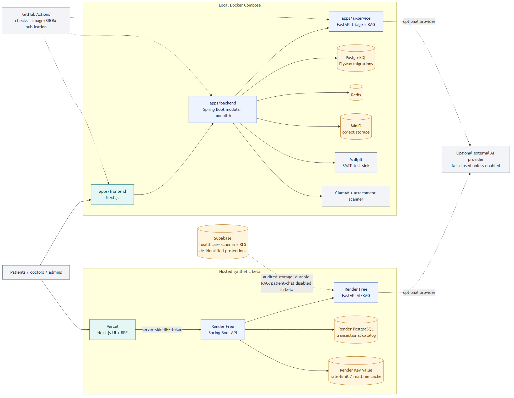

# HealthCare system overview

The diagram below is the current logical/deployment map. It distinguishes the
hosted synthetic beta from the local Docker Compose topology so a local service
is not mistaken for a production dependency. The single source of truth is the
[Mermaid source](system-overview.mmd); the rendered PNG is included for readers
whose Markdown viewer does not render Mermaid.

## Reading the boundaries

- The browser reaches the hosted backend through the Next.js BFF; the
  browser never receives the backend-to-backend service token.
- Spring owns transactional healthcare workflows, RBAC, catalog data and the
  authenticated AI gateway. FastAPI owns triage, bounded retrieval and
  provider-neutral chat contracts.
- PostgreSQL, Redis, MinIO, Mailpit and ClamAV are local Compose dependencies;
  their local readiness does not prove hosted or production readiness.
- Supabase is an audited, RLS-protected data boundary. The current beta keeps
  durable RAG and patient-chat consumers disabled; see
  [`docs/deployment-beta.md`](../deployment-beta.md) for the evidence record.
- Dashed provider edges are optional and fail closed unless the corresponding
  runtime flag and credential/model are configured.

The canonical editable source is [`system-overview.mmd`](system-overview.mmd).
When service boundaries change, update that source and this short rationale
together, then re-check the README link and Mermaid rendering.
