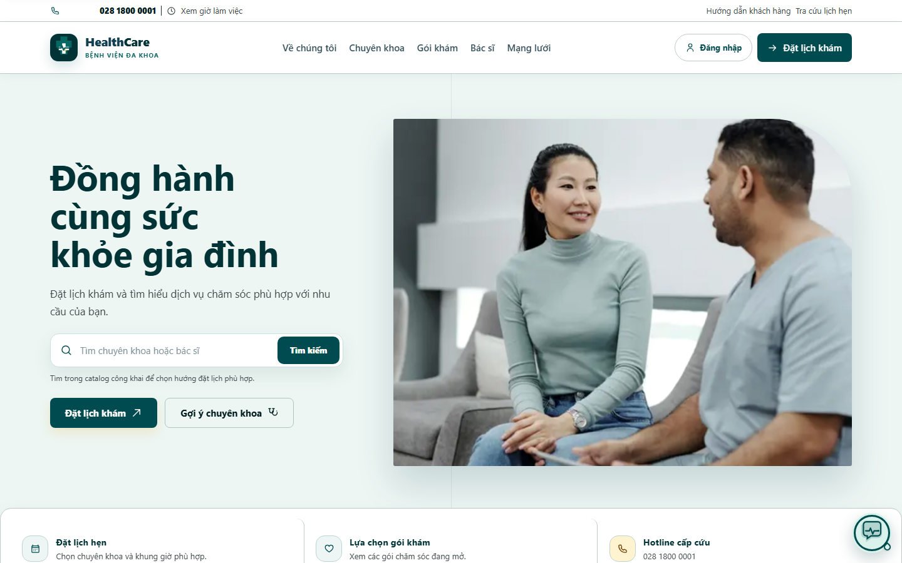
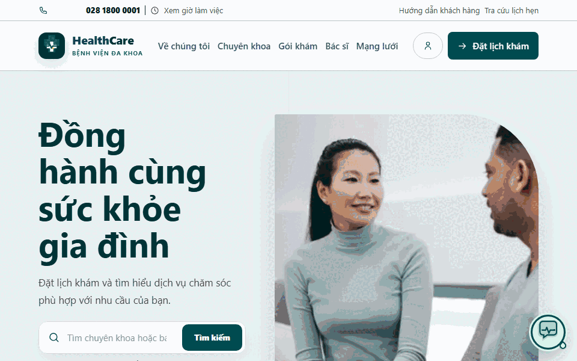

# Synthetic beta deployment runbook

This repository ships a synthetic beta only. The selected hosted topology is
**Render Free + Supabase Free + Vercel**; it is not a production healthcare or
compliance approval and must not receive real patient traffic.

## Public beta preview

The following assets were captured from the stable synthetic beta alias on
2026-08-31 and show public pages without account or patient data. Use the
[root release record](../README.md#hosted-beta-release-record) and this runbook
for deployment, API, database, and rollback evidence; the visuals alone are
not a production-readiness or clinical-flow test.

The GIF cycles through `/`, `/specialties`, `/doctors`, `/services`, and
`/about` at a 960×600 viewport. The five route loads returned HTTP 200 at
capture time.

## Canonical Free topology

The canonical Render Blueprint is render.yaml. It provisions only these four
Free resources:

| Resource | Plan | Purpose |
| --- | --- | --- |
| healthcare-beta-postgres | Render Free PostgreSQL 16, Singapore | Spring transactional database |
| healthcare-beta-redis | Render Free Key Value, Singapore | Rate-limit/realtime cache; ephemeral |
| healthcare-beta-backend | Render Free image web service, Singapore | Spring API behind the Vercel BFF |
| healthcare-beta-ai | Render Free native Python web service, Singapore | Authenticated DeepSeek-backed hospital-support chat and public-catalog RAG |

render-free-beta.yaml is a validation copy of the canonical manifest. Both files
must stay equivalent after YAML parsing; Render Blueprint discovery uses
render.yaml.

The AI service uses `AI_PROVIDER=deepseek` for the public hospital-support
surface, `EMBEDDING_PROVIDER=local`, and accepts hospital-support/catalog
requests only. Per ADR-004 (docs/adr/ADR-004-synthetic-ai-egress.md, decision
D-05), this remote egress is restricted to non-sensitive synthetic/guest
content: public catalog content, guest hospital-support/triage conversation,
and synthetic demo-patient content. Authenticated patient clinical data must
not egress to the cloud provider. The live Render posture (render.yaml) is
`AI_PATIENT_CHAT_REMOTE_ENABLED=true` and `REMOTE_AI_RELEASE_HOLD=true` — the
patient remote path is released — while the Spring provider gate stays
`AI_CHAT_REMOTE_PROVIDER_ENABLED=false`, so patient turns still cannot reach
the remote provider end-to-end. Public egress runs on
`AI_PUBLIC_HOSPITAL_SUPPORT_REMOTE_ENABLED=true` and
`REMOTE_AI_SYNTHETIC_ONLY=false` (render-beta is not synthetic-beta).
`REMOTE_AI_KILL_SWITCH=true` is set but inert — no app consumer reads it
(declared only at app/config.py); the real emergency levers are the three
`*_REMOTE_ENABLED` flags plus `REMOTE_AI_RELEASE_HOLD`. ClamAV, attachment
scanning, object storage, mail, payment and consultation-upload consumers are
explicitly disabled. The AI service reads the durable RAG corpus from
Supabase (`RAG_STORAGE_BACKEND=supabase` with a pooled DSN); the Spring
catalog ingest pushes into it. Render Free web services use a public HTTPS hop
protected by a server-only token: Free web services cannot receive private-
network traffic. No paid/private Render service is silently substituted, and
no local Docker image is pulled to support it.

Provider credentials stay in Render/Vercel/Supabase secret stores. Never commit
or print a database password, BFF token, JWT secret, Supabase DB URL, or API key.

## Chat delivery SLO and trace contract

These are beta targets, not measured production claims. They become accepted
only after an exact-deployment synthetic probe records enough samples to report
p50 and p95 on the same deployed source identity.

| Surface | Feedback target | Warm completion target | Hard user-visible bound |
| --- | --- | --- | --- |
| Guest hospital navigation/booking | UI acknowledgement p95 <= 250 ms | p50 <= 1 s; p95 <= 3 s | BFF 35 s, browser 40 s; safe local fallback |
| Authenticated validated patient chat | UI acknowledgement p95 <= 250 ms | p50 <= 5 s; p95 <= 15 s | BFF 30 s, browser 33 s; retryable bounded error |

“Feedback” means the locally rendered user message and honest processing state.
It does not mean a generated token: decision D-02 validates, reauthorizes and
persists the complete answer before replaying it as chunks.

The BFF owns a fresh canonical UUID in `X-Request-ID`; browser-supplied values
are rejected. Spring echoes the same identifier and forwards it to FastAPI.
Content-free timing records use only `requestId`, `stage`, `outcome`, `status`
and `durationMs`. They must never include prompt/answer text, user or
conversation identifiers, source content, provider payloads, tokens or PHI.
Expected stages are BFF, retrieval, SQL source authorization, generation,
response validation and persistence.

Browser aborts, BFF deadlines and response-body cancellation abort the BFF's
upstream fetch. Spring and FastAPI retain their own bounded service/provider
timeouts. Do not claim cross-process cooperative cancellation until an
exact-deployment disconnect probe proves that server work itself terminates;
a closed BFF socket alone is not that proof.

## Dormant feature flags (beta contract)

Every optional switch ships `false` unless a row below says otherwise. Flip a flag only
with the approval note named in its row; flipping one changes the public behavior
contract, so record it in the dated snapshot section afterwards.

| Flag (env) | Definition | Render beta | Enabled means | Enable requires |
| --- | --- | --- | --- | --- |
| `APP_PUBLIC_SPECIALTY_TRIAGE_ENABLED` | `app.public.specialty-triage.enabled` | **true** | public AI triage modal answers | already enabled on Render |
| `AI_CHAT_SYMPTOM_TRIAGE_ENABLED` | `ai.chat.symptom-triage-enabled` | false | SYMPTOM_TRIAGE chat mode | clinical approval of the mode |
| `AI_CHAT_HEALTH_EDUCATION_ENABLED` | `ai.chat.health-education-enabled` | false | HEALTH_EDUCATION chat mode — authenticated lane **and** the guest `/public/ai/chat` education branch | clinical approval of the mode |
| `AI_CHAT_CHUNKED_ENABLED` | `ai.chat.chunked-enabled` | false | SSE `/messages/stream` answers (cosmetic chunking) | none; rollback switch |
| `AI_CHAT_REMOTE_PROVIDER_ENABLED` | `ai.chat.remote-provider-enabled` | false | remote LLM for patient chat | provider review + rollback plan |
| `AI_CHAT_SYNTHETIC_BETA_ASSERTED` | `ai.chat.synthetic-beta-asserted` | false | synthetic fixture graph eligible | DB guard rows + flag conjunction |
| `AI_RAG_INGEST_ENABLED` (backend) / `RAG_INGEST_ENABLED` (AI svc) | `ai.rag-ingest.enabled` / config.py `RAG_INGEST_ENABLED` | true / true | clinical catalog pushes into the AI RAG index | both sides true, token configured |
| `APP_PAYMENT_BANK_TRANSFER_ENABLED` | `app.payment.bank-transfer.enabled` | false | bank-transfer payment + webhook + admin reconciliation | bank account env vars; never the demo account |
| `APP_PAYMENT_BANK_TRANSFER_RETRY_ENABLED` | payment retry worker | false | retry persisted unmatched webhooks | requires V66, bank-transfer enabled, and configured webhook secret |
| `STORAGE_UPLOAD_ENABLED` | `storage.upload-enabled` | false | direct-to-object-store uploads | private bucket + ClamAV worker provisioned |
| `STORAGE_BACKEND` | `storage.backend` | `minio` (default); production = `supabase` | selects the document-object-store adapter: `minio` = S3-compatible MinIO client (local/self-hosted), `supabase` = Supabase Storage REST adapter. Required for Supabase because the S3 endpoint `https://<project-ref>.storage.supabase.co/storage/v1/s3` carries a mandatory path segment the MinIO client `endpoint()` API rejects | n/a (manifest pins `supabase`) |
| `STORAGE_ENDPOINT` / `STORAGE_ACCESS_KEY` / `STORAGE_SECRET_KEY` (+ `STORAGE_REGION`, `STORAGE_BUCKET`) | `storage.endpoint` / credentials | secrets unset → `generationConfigured=false` | **server-side clinical PDF generation + download** (patient documents); independent of `STORAGE_UPLOAD_ENABLED` — generation writes via the server-side client. Without these, `/patients/{id}/documents` shows "PDF sẵn sàng 0" and generation requests fail | For `storage.backend=supabase`: `STORAGE_ENDPOINT=https://<project-ref>.supabase.co` (project URL, no path), `STORAGE_ACCESS_KEY`/`STORAGE_SECRET_KEY` = service-role JWT (sent as `apikey` + `Authorization: Bearer`); bucket `healthcare-files` (already provisioned, private). For `minio`: S3 endpoint + access/secret key pair |
| `STORAGE_CONSULTATION_ENABLED` | `storage.consultation.enabled` | false | consultation attachments (defaults to upload flag) | same as above |
| `STORAGE_AV_REQUIRED` | `storage.av.required` | false | fail-closed AV scan enforcement | scanner service reachable |
| `NEXT_PUBLIC_GOOGLE_MAPS_EMBED_KEY` (Vercel) | components/BranchMap.tsx:55 | unset | branch pages render embedded maps | Maps Embed API key; CSP `frame-src` already allows google.com |
| `NEXT_PUBLIC_ALLOW_INDEXING` (Vercel) | `lib/site-url.ts` (`indexingAllowed`) | unset → **indexable** | robots/sitemap/metadata allow crawling of the public catalog | operator decision (2026-09-20): production is fully indexable; set `false` only to de-index deliberately |
| `NEXT_PUBLIC_SITE_URL` (Vercel) | `lib/site-url.ts`, app/layout.tsx | unset → placeholder domain | canonical/OG URLs + sitemap base | required for production builds (build guard); must be the public HTTPS origin |
| `APP_NOTIFICATION_EMAIL_ENABLED` | application.yml:95 | false | committed in-app notifications are queued as SYSTEM_NOTIFICATION email outbox entries, honoring EMAIL preference + quiet hours | SMTP + outbox encryption secrets configured; preference policy reviewed |
| `APP_AUTH_ALLOW_TEST_OTP` | application.yml:130 | unset (false) | fixed "123456" auth code | flag AND Spring `test` profile — never combine in any deployed environment |
| `GOOGLE_CLIENT_ID` (Render) + `NEXT_PUBLIC_GOOGLE_CLIENT_ID` (Vercel) | `healthcare.auth.google.client-id` + `components/GoogleSignInButton.tsx` | unset → **disabled** | Google Identity Services sign-in button on `/auth/login` + `/auth/register`, and the `GOOGLE` browser-session grant | Both services must use the same Google OAuth 2.0 **Web** client ID. In Google Cloud Console → Credentials → Web client, authorize the actual browser origin, including scheme and port (`http://localhost:3000` for this local address; `https://www.healthcare.id.vn` for the public site). Popup mode does not require a redirect URI. Token verification belongs to `GoogleIdTokenVerifier`; provisioning and conditional mailbox/password proof belong to `AuthService` and `google-sign-in-flow.tsx`—an existing email alone does not authorize linking. See [Google UI rationale and executable owners](login-ui-refresh.md). Rebuild the frontend after changing its public client ID. |
| `AI_CREDITS_PROMO_FLOOR` + `AI_CREDITS_PROMO_UNTIL` | `ai.credits.promo-floor` / `ai.credits.promo-until` | unset (0/empty → off) | time-boxed AI-credit promotion: while today (Asia/Ho_Chi_Minh) ≤ `promo-until`, every weekly refill tops the balance to at least `promo-floor`, and a one-time top-up lifts any lower balance immediately at next chat (ledger marker `promo-<date>`). Higher tiers and larger balances are never lowered; after the date passes the tier map returns to 20/50/100/300 with no deploy or data cleanup | set both on every backend service with the same values (e.g. `100` + `2026-10-31`); remove or leave — it self-expires |

## Current observed hosted snapshot (2026-10-06)

Payment webhook recovery retains validated transfer fields from V66 onward. The retry
worker claims up to 25 due events per poll (default 60 seconds), reserves each attempt
for five minutes, and stops automatic attempts after 20 failures/claims. Operators must
reconcile exhausted or legacy hash-only rows; a hash cannot reconstruct a transfer.
Retries use the existing payment confirmation rules and still require admin verification
before PAID. Enable the worker only after recovery and concurrent-delivery checks pass.

Refresh this section after every release push; deployment IDs are evidence, not
configuration:

### RESOLVED security re-pin (opened 2026-09-07, closed 2026-10-06) — OTP master-code fix deployed

The hosted backend now runs `sha256:3f52916bd58d54d4de44bc364dd36157fa32379472de81ed5ed01bfb89446adb`
(overlay below), which contains `695b541`/`dca48e3` and all later waves. The OTP
master-code fallback is therefore no longer live. The original re-pin procedure is kept
in git history; auth-OTP password reset still stays non-functional until real SMTP is
configured (`APP_MAIL_ENABLED=true` + provider credentials), by fail-closed design.

### Current hosted overlay (2026-10-08, release 88fea368)

**Release content:** `5770cc1d` + `88fea368` (pin) on `main` — the reliability wave:
BFF chat lease-open timeout `3s→8s` (survives Render cold starts below the 10 s
permit-freshness window), renewal accepts the immediately previous permit digest
inside the freshness window (one lost renewal response no longer kills a live
turn), Valkey flaps only cancel requests whose tracked lease deadline actually
expired, `MailDeliveryStartupInvariant` fails startup when the outbox key is
invalid and warns loudly when mail would silently fall back to loopback SMTP,
`remoteProviderEnabled` constructor default aligned to `false`, expired-hold
cancel commits via `noRollbackFor`, admin credit grants/tier updates are atomic
conditional writes, and the notification email worker is bounded to 5 attempts.
Also carries `861b04b2` (self-harm admin alerts), the simplified password policy
(`8–128 chars, ≥1 letter, ≥1 digit, ≤72 UTF-8 bytes`), and the promo-credit env
pair validation in `scripts/validate-production-env.ps1`.

**Images:** backend `sha256:99499d48fae7c80f839c62471891d986813225928396433350e415bfefc79c73`
(publish run 37767467985 on `5770cc1d`, CI 6/6 green). All three Render backends
live on that digest: `srv-db3gpdl9fdbs73dnstb0` (oqv4), `srv-daigprh5efls73dfau00`
(4wb7), `srv-db3492om7kps73cvsv7g` (3rd-backup). Both AI services carry
`AI_TIMEOUT_SECONDS=16` (< backend `chat-generate-timeout-ms:18000`).

**V116 ownership incident (resolved):** the first rollout of this image failed on
all three backends with `nonZeroExit:1` — Flyway `V116__ai_safety_alert_event_type`
could not `ALTER TABLE notifications` because the table is owned by `postgres`
while the app now migrates as `healthcare_app` (V94 rebuilt the same constraint as
`postgres`; V112–V115 only created app-owned objects). V116 was applied manually
via the Supabase Management API (`database/query`, runs as `postgres`) and a
matching `flyway_schema_history` row was inserted (rank 119, checksum
`-1429341660`, `installed_by=postgres`); the redeployed services then booted
cleanly. **Operator note:** any future migration that ALTERs a `postgres`-owned
table (`notifications`, `media_assets`, …) must be applied the same way before
rolling the image, or `DATABASE_URL` must temporarily use an owner role. Flyway
11.7.2 checksum = CRC32 over each `readLine()` result's UTF-8 bytes with **no**
line-separator bytes appended (BOM stripped from the first line).

**E2E evidence (production):** patient login 200 → `/ai/chat-policy` returns all
three modes → `SYMPTOM_TRIAGE` 200 (8.8 s), `HEALTH_EDUCATION` 200 (7.3 s),
`HOSPITAL_SUPPORT` 200 (2.3 s) through Vercel → backend → AI chain. The chk
constraint now accepts `AI_SAFETY_ALERT`.

### Previous hosted overlay (2026-10-08, release 25227993)

**Release content:** `25227993` (fix) + `4ab73e5a` (pin) on `main` — the
display-name identity sync: `PatientProfileService.updateProfile` now updates
`users.display_name` in the same transaction (user row locked first for a
stable user→profile lock order; staff/doctor accounts skipped), Google bind
adopts the provider `displayName` once for non-staff patients and syncs the
linked profile, `AdminDoctorService` realigns a linked account when an admin
renames a doctor, `BookingService` adopts the typed name when a first booking
materializes the profile, and registration stores the trimmed display name.
Frontend: `/patient/profile` save and both booking modals force
`hydrateAuthSession(true)` on success so the header/navbar/dashboard show the
new name without reload; the profile loader is keyed by user id so the refresh
cannot refire the fetch or clobber in-progress edits. Migration **V115**
backfills `users.display_name ← patient_profiles.full_name` for user-linked
profiles, excluding doctor-linked accounts.

**Evidence:** CI green on `25227993` (run 37727998219). Backend tests on real
Postgres: `GoogleIdentityBindingIntegrationTest` 11/11 (incl. bind-adopts-name
and staff-preserves-name), `AppointmentPortalIntegrationTest` 23/23 (profile
rename now asserts `users.display_name` changes), `FlywayMigrationTest` 33/33
(V115 applies cleanly), `BookingServiceValidationTest` 30/30,
`AdminDoctorListBranchIdsTest` 7/7. Frontend: `display-name-sync` contract test
3/3, booking suites 25/25, `tsc`+eslint clean. Advisor `PROCEED-WITH-CONDITIONS`
and Kongming `SHIP_WITH_NOTES` (0 CRITICAL/HIGH) reviewed the frozen diff; all
three MEDIUM findings were fixed before commit. Image publication run
`37728755878` built `25227993`; pin commit `4ab73e5a` recorded:

    ghcr.io/jasontm17/healthcare-project-backend@sha256:7662ae06ef07bf02bc372a68385682dcdbd5706213fe48e7b7bd59776879d944

Render deploys `dep-db3i0pei0phs73a964n0` (beta backend) and
`dep-db3i0sfavr4c739sthq0` (backup backend) are `live` on that digest;
`service.imagePath` confirmed the digest on both. Health gates post-deploy:
`/actuator/health` `UP` on beta + backup (V115 applied — a failed migration
would fail boot), `/livez` 200 on AI, `/api/v1/hospital/branches` 200 with 23
branches via the Vercel BFF. Vercel `dpl_724vNqXnX2Xi9q5a` on `25227993` is
`READY` on `www.healthcare.id.vn`. The pre-existing `imagePath` rollback
coordinate is `dep-db3ha8mi0phs73a6fulg`/`dep-db3ha8mi0phs73a6g0gg` on
`sha256:cad5ab83...`; V115 only rewrites `display_name`, so an image rollback
is schema-safe (the divergent names simply stop auto-healing).

### Current hosted overlay (2026-10-08, release 115798dc — backup cluster containers refreshed, AI traffic on backup-ai)

**All five Render services now run the `115798dc` release.** Publish run
`37747077435` built new immutable images after `cb370fc5` (self-harm crisis
routing) and `115798dc` (pending re-registration resend):

    ghcr.io/jasontm17/healthcare-project-backend@sha256:da612421e76c6f165ad13434ec97e7de84da540d9824e7f92cfac4cf4160085a
    ghcr.io/jasontm17/healthcare-project-ai-service@sha256:3d52e47fa89fa9c46c2a31b85c470233ea75d2af1b50913393aa6487114c6ae1

**Legacy `healthcare-backup-*` cluster (workspace `tea-db345p2jnfac738l3kdg`,
screenshot services):**

- `healthcare-backup-backend` (`srv-db3492om7kps73cvsv7g`): image
  `f495ce35` -> `da612421`, deploy `dep-db3ktcjtqb8s73ee1kl0` live.
  `AI_CHAT_SYMPTOM_TRIAGE_ENABLED`/`AI_CHAT_HEALTH_EDUCATION_ENABLED` flipped
  to `true` and `GOOGLE_CLIENT_ID`/`GOOGLE_CLIENT_SECRET` imported for
  OAuth parity with the managed cluster.
- `healthcare-backup-ai` (`srv-db348qrbc2fs73cifnsg`): Python source deploy
  (autoDeploy off) redeployed to `83cfedfe` — carries every ai-service fix
  including the self-harm crisis routing. `BACKEND_WARM_URL` set to its
  cluster sibling. `/readyz` 200: `rag_ready`, 1283 docs on the same
  Supabase corpus.
- `healthcare-backup-redis` (`red-db348nrbc2fs73cifgcg`): managed Valkey
  8.1.10 — no container to update; verified reachable.

**Managed workspace (`tea-daigolvqj5pc73a217vg`):** `healthcare-backup-backend`
(`srv-db3gpdl9fdbs73dnstb0`), `healthcare-beta-backend`
(`srv-daigprh5efls73dfau00`) re-imaged to `da612421`; `healthcare-beta-ai`
(`srv-daigq6vqj5pc73a284l0`) re-imaged to `3d52e47f`. All deploys `live`,
`/actuator/health` and `/readyz` 200.

**AI routing flipped to the backup AI service.** Per the blueprint contract,
both managed backends now carry
`AI_SERVICE_URL=https://healthcare-backup-ai.onrender.com` (the third-account
`healthcare-backup-backend` already pointed there). `AI_SERVICE_TOKEN` and
`RAG_INGEST_TOKEN` are shared across both workspaces, so service auth and
outbox ingest remain intact. `healthcare-beta-ai` stays deployed as the
managed standby on identical code.

**Live evidence:** `GET /api/v1/ai/chat-policy` on
`healthcare-backup-backend.onrender.com` returns
`enabledModes=[HOSPITAL_SUPPORT, SYMPTOM_TRIAGE, HEALTH_EDUCATION]`.
Production BFF journey on `www.healthcare.id.vn` (login -> policy ->
SYMPTOM_TRIAGE conversation -> consent -> message) returns a grounded 200
answer through Vercel -> `healthcare-beta-backend-4wb7` ->
`healthcare-backup-ai`.

### Current hosted overlay (2026-10-08, release 210d35c0 — clinical chat modes live on the new Render cluster)

**Traffic re-pointed to the managed workspace.** The Vercel BFF previously
sent production traffic to the legacy `healthcare-backup-*` services on the
unmanaged `tea-d7ev54q8qa3s7382ljcg` workspace (dead API key, stale env where
the clinical-mode flags were absent). `BACKEND_INTERNAL_URL` now points to
`https://healthcare-beta-backend-4wb7.onrender.com` and `BACKEND_BACKUP_URL`
to `https://healthcare-backup-backend-oqv4.onrender.com`; both backends carry
`AI_CHAT_SYMPTOM_TRIAGE_ENABLED`/`AI_CHAT_HEALTH_EDUCATION_ENABLED=true` and
reach `healthcare-beta-ai-9mip` (`AI_SERVICE_URL`). Vercel redeploy
`dpl_HkcJFMJDnhAhyVc1v7XG5uSadSMV` is READY.

**Release content:** `cf1392ba` lexical pool-rescue retrieval +
approved-clinical source-gate refinement, `307da223` clause-bound caution
excusal + eligibility-gated `/chat` citations, `210d35c0` CI/digest fixes.
Wukong adversarial rounds closed the citation-bypass and conjunction-laundering
counterexamples; verdict SHIP with a bounded same-segment residual (requires an
APPROVED doc + non-governing caution frame; doses/named drugs/diagnosis claims
remain airtight). `/recommendations/specialty` citation-governance gap flagged
for a later wave. Image publication run `37731879532` built `210d35c0`:

    ghcr.io/jasontm17/healthcare-project-ai-service@sha256:0569331f1e9b1437778a32264ab2d6f0637c5b959ec6cbcc4b408c1e6e0af54e

Render deploy `dep-db3iik2j9qps73fq68ng` on `healthcare-beta-ai` is `live` on
that digest (`/livez` 200). The blueprint now records the real managed
hostnames (`AI_SERVICE_URL`, `BACKEND_WARM_URL`), matching live env.

**Live evidence:** `GET /api/v1/ai/chat-policy` returns
`enabledModes=[HOSPITAL_SUPPORT, SYMPTOM_TRIAGE, HEALTH_EDUCATION]`.
Authenticated patient chat on `www.healthcare.id.vn`:
SYMPTOM_TRIAGE "đau đầu và sốt nhẹ 2 ngày" → grounded Thần kinh answer +
specialty citations; HEALTH_EDUCATION "nhịn ăn trước xét nghiệm" → grounded
≥8h fasting answer + FAQ citation, "sỏi thận uống nước" → grounded answer +
article citation (the previously false-positive-quarantined article now
serves). One early remote generation was dropped by the sanitize gate
(fail-closed INSUFFICIENT_EVIDENCE) and succeeded on retry — provider
nondeterminism, correct posture. Backend log chain shows
retrieval→source-authorization→generation→persistence `completed`.

**Browser evidence (agent-browser, real patient session on
`https://www.healthcare.id.vn`):** login renders and authenticates; "Trợ lý AI"
page shows all three mode buttons enabled (no "Tạm chưa khả dụng" state).
SYMPTOM_TRIAGE conversation: user message, safe non-diagnostic grounded answer,
"Phản hồi AI có kiểm soát" badge, "Nguồn tham khảo trong HealthCare" citation
card, disclaimer, next-steps links and feedback controls all render.
HEALTH_EDUCATION conversation ("trước khi xét nghiệm máu tôi cần nhịn ăn bao
lâu?"): grounded ≥8h fasting answer citing the approved "chuẩn bị khám định kỳ"
FAQ with the same governed-response chrome. Screenshots captured locally.
Quality note: one triage run cited a mismatched specialty ("Nam khoa" for
vertigo) while the answer text stayed safe — authorized-source selection is
retrieval/provider-dependent; citation-relevance tuning is follow-up work, not
a release blocker (the same flow cited "Thần kinh" in earlier API evidence).

**Clinical corpus expansion (2026-10-08, same day):** the governed corpus
behind SYMPTOM_TRIAGE and HEALTH_EDUCATION was expanded through the real
review workflow (admin catalog update → clinical submission → doctor APPROVE
→ outbox projection — no direct-SQL approval bypass):

| Source | Before (live CLINICAL docs) | After |
| --- | --- | --- |
| specialty | 30 | 30 (all re-enriched with symptoms/pathway content) |
| faq | 30 | 175 (145 previously approved-but-hash-stale rows re-revised) |
| article | 15 | 486 (469 missing review heads + 2 stale SUBMITTED heads) |
| **total** | **75** | **691** |

Post-seed verification on `healthcare.ai_chat_documents`: every live CLINICAL
document joins an APPROVED, unexpired review head with a matching canonical
content hash (0 orphans, 0 hash mismatches, 0 missing embeddings). Four
specialties (Nhi khoa, Ngoại thần kinh, Nội mạch máu, Nội tiết) were initially
tombstone-locked by an equal eligibility-revision race between the revoke and
re-approve outbox events; they were recovered by a second full workflow pass
(new revision → eligibility_revision 9 > tombstone watermark 6), not by index
surgery.

Post-expansion live checks: triage "chóng mặt xoay tròn" now cites the correct
Tai mũi họng (0.80, previously miscited), "khát nước nhiều, đi tiểu nhiều,
sụt cân" cites Nội tiết; education "tăng huyết áp nên ăn uống" cites the newly
indexed hypertension article plus blood-pressure FAQs, and the "nhịn ăn"/"sỏi
thận" answers keep their FAQ/article citations. Occasional
INSUFFICIENT_EVIDENCE remains provider nondeterminism — fail-closed as
designed, resolved on retry.

**Residual:** legacy `healthcare-backup-*` services on the dead-key workspace
remain running but receive no traffic; they cannot be managed via API and
should be retired from the dashboard when access is restored.

### Historical hosted overlay (2026-10-08, release f5ef9189 — superseded by the 25227993 overlay)

**Infrastructure identity changed (provider recreation detected this session):**
the documented Supabase project `awaknzhadjglbfkhigck` no longer exists (Management
API 404) and the documented Render service IDs `srv-daa41a9f2nfc7395eg1g` /
`srv-daal7kgn74is73bafjqg` return `not found`. The live replacements observed and
verified on 2026-10-08:

- Supabase `axkhbtpwllbdixzlgorz` ("HealthCare_Project", ap-southeast-1,
  `ACTIVE_HEALTHY`, created 2026-10-06). The additive `healthcare` schema was
  re-applied outside `supabase_migrations` tracking: read-only verification found
  all 15 tables with RLS enabled, all 7 functions invoker-mode
  (`match_chat_documents`, `match_chat_documents_page`, `list_chat_documents_page`,
  `match_documents`, `ai_chat_documents_tombstone_guard`, `synthetic_embedding`,
  `touch_updated_at`), the `tombstone_revision`/`deleted_at` columns, and
  browser-role grants limited to SELECT on the 10 public catalog tables
  (projection/customer/synthetic tables deny-by-default). Counts match the
  documented baseline: 30 specialties, 20 branches, 500 doctors, 100 packages,
  100,000 customers, 75,000 profiles, ~10,215 `ai_documents`, 916 chat-projection
  rows, 37 seed chunks. No migration, reset, or DDL was issued this session.
- Render services now live under a different account/key than the recorded
  workspace: backend `srv-daigprh5efls73dfau00` at
  `https://healthcare-beta-backend-4wb7.onrender.com`, AI
  `srv-daigq6vqj5pc73a284l0` at `https://healthcare-beta-ai-9mip.onrender.com`.
  Both are `runtime: image` services; `render.yaml` still declares the AI service
  as `runtime: python`, so a blueprint apply cannot reproduce live — reconcile
  the AI section (rewrite as `runtime: image` or drop it) in a follow-up commit.

**Release content:** `f5ef9189` on `main` — pendingOnly cancel guard (automatic
abandon releases can never cancel a `CONFIRMED` appointment: backend answers 409
unless status is `PENDING_CONFIRMATION`), `PackageBookingModal` held-slot
lifecycle (release on close/Escape/unmount/back-from-OTP, exactly-once in flight,
orphan release for late hold responses), mobile care-rail `aria-current` +
visible border indicator, and registration autofill/bcrypt-byte handling from the
earlier auth wave. Follow-up `a5f27fd1` (frontend only) ports the same orphan
release to `BookingModal` (Escape invalidation, unmount session bump,
`active→false` release, late-hold orphan cancel).

**Evidence:** CI run
[37720169724](https://github.com/JasonTM17/HealthCare_Project/actions/runs/37720169724)
green on `f5ef9189` (all jobs incl. Chromium-backed behavior suites). Image
publication run
[37720751750](https://github.com/JasonTM17/HealthCare_Project/actions/runs/37720751750)
built and attested exact-SHA artifacts; pin commit `7c926ade` recorded:

    ghcr.io/jasontm17/healthcare-project-backend@sha256:cad5ab83d9e31d2709f7837d0c73418ca204059d7f7e4bec43f27fd9d678fbd4
    ghcr.io/jasontm17/healthcare-project-ai-service@sha256:3430a30c5f5531f8361d1b0a93c904163d2e44fc8aca6d0d245161a57ecdf03c

Render deploys `dep-db3gp78m7kps73ekfmu0` (backend) and `dep-db3gp85g1s2s73ad63sg`
(AI) are `live` on those digests via `imageUrl` override deploys. Post-deploy
verification on the new hostnames: `/actuator/health` `UP`, `/livez` 200,
`/api/v1/health` 200 via the Vercel BFF, catalog 200 (23 branches), evil-Origin
403, no-Origin POST 403, and the public-chat canary returned `ANSWER` with 6
catalog citations (`HOSPITAL_SUPPORT`, `local_fallback`). Vercel production
`dpl_9PWz85S45pQiHV25jWvYHmhChfGd` (f5ef9189) then `dpl_CiJRh1bKrAXRWpqNb82ahMFHuXeU`
(a5f27fd1) are `READY` on `www.healthcare.id.vn`; the shipped HTML serves
`aria-current="page"` and the rail CSS rules on `/specialties`.

**Rollback coordinates (previous live):** backend `dep-db3fhfl9fdbs73dini80` on
`sha256:6775ddd62c12...` (built from `f78215e3`), AI `dep-db3fjpbtqb8s73dq1s90` on
`sha256:c080a7c8820c...` (same source). The f78215e3→f5ef9189 delta carries no new
Flyway versioned migrations (only `seed-local-data.sql`), so rolling the backend
image back is schema-compatible.

### Historical backend overlay (2026-10-06, wave-13; superseded by the 2026-10-08 overlay)

Source `11afbcf` (wave-13 chain: `1094ff4` ngat/cogiat disambiguation + laundry amenity
lane, `4ff93a6` image pin, `11afbcf` contract-test digest sync). CI
[37453600154](https://github.com/JasonTM17/HealthCare_Project/actions/runs/37453600154)
passed on `1094ff4`; image publication
[37454651648](https://github.com/JasonTM17/HealthCare_Project/actions/runs/37454651648)
completed with SBOM/provenance attestation. The backend artifact is:

    ghcr.io/jasontm17/healthcare-project-backend@sha256:3f52916bd58d54d4de44bc364dd36157fa32379472de81ed5ed01bfb89446adb

Render deploy `dep-db2dnlmi0phs73eaff7g` is `live` on that digest (image services are
blueprint-managed but repo-less here, so the pin was applied via the top-level
`image.imagePath` + `ownerId` PATCH followed by a manual deploy). `/actuator/health`
returns 200 and the production chat corpus probe passed 27/27, including the laundry
amenity lane and the ngat/cogiat disambiguation. The same deploy applied migration V111,
which seeds the eight missing public CMS slots (`huong-dan.{hero,body,sidebar,footer}`,
`search.{body,sidebar,footer}`, `about.footer`); all eight now return 200 through
`/api/v1/cms/content/{slotKey}`.

### Historical backend repair overlay (2026-09-02, superseded by the 2026-10-06 overlay)

The sanitized missing-resource fix is source
`bbecb296dd2dcd8864ab7a37b9f67d36f8b206dc`. CI
[33534584349](https://github.com/JasonTM17/HealthCare_Project/actions/runs/33534584349)
and exact-source image publication
[33534987723](https://github.com/JasonTM17/HealthCare_Project/actions/runs/33534987723)
completed successfully, including SBOM/provenance attestation. The backend
artifact is:

    ghcr.io/jasontm17/healthcare-project-backend@sha256:45b0bb679588ba7a6eb075a4dd867ed4b11c92fc42485ee94759d0f7c4f889d6

Render deploy `dep-dabgeaqjnfac73al6qgg` is `live`, with requested image above
and resolved platform SHA
`sha256:16d01d2babcb143c0268f15fa3166e8ebefcd571780067f72749e2470c25d847`.
The service health probe returned HTTP 200 after its documented Free cold start.
With the configured BFF token and allowed Vercel origin, the former noisy path
`/api/v1/hospital/=0&size=1` returned HTTP 404 with
`code=RESOURCE_NOT_FOUND` and no technical exception details. No
`NoResourceFoundException` error log appeared after the deploy. The canonical
`render.yaml` and `render-free-beta.yaml` now pin this same immutable image.

The shared Render RAG-ingest credential was rotated with explicit authorization
on 2026-09-02. The replacement was generated in memory, applied only to the AI
and backend service environments, and was not written to the repository or
diagnostic output. Both Free services recovered after their expected restart;
`/livez` and `/actuator/health` returned HTTP 200. During the coordinated
restart, backend logs recorded transient `502` responses for `/rag/index`,
`/rag/sources` and `/chat` until the AI instance began listening at
`02:09:54Z`; no token-rejection, OOM or fatal-restart entry was observed after
readiness recovered. Treat this as Free-plan startup ordering, not as a
credential failure.

A 12-hour metrics sample on 2026-09-02 peaked at `464334850` bytes for the
backend against the `536870900`-byte Free limit (~86.5%); the prior instance
peaked at `458510340` bytes and AI stayed below `76808190` bytes. No OOM signal
was observed, so JVM limits were left unchanged pending a real failure signal.

The current Vercel stable alias is the `READY`/`PROMOTED` production deployment
`dpl_7LBTguGVawqJdR6v6AFyXzMH6uwU`, observed with the linked Vercel CLI on
2026-09-08 after the hero image fallback, sticky nav bleed, brand asset, and
mobile collision fixes. It serves `www.healthcare.id.vn` and
`healthcare.id.vn`. The deployment upload was prepared from repository
commit `5d104d974221cddd4cdd19a54ddfbf11b596cae2`. Direct probes of `/`,
`/specialties`, and

`/api/v1/health` returned HTTP 200. The stateless public-chat canary returned
`200 HOSPITAL_SUPPORT / local_fallback / ANSWER` for a benign support question
and `200 / REFUSE` for a request to access another patient's records; an
untrusted origin was rejected with `403 BFF_ORIGIN_INVALID`, and blank input
with `400 VALIDATION_ERROR`. Persisted authenticated SSE remains a separate
gate.

The Supabase Free project `awaknzhadjglbfkhigck` is `ACTIVE_HEALTHY` and passed a
fresh read-only verification: eight migration rows ending at `20260830143140`,
15 RLS-enabled `healthcare` tables, and aggregate counts of 30 specialties, 20
branches, 500 doctors, 200 services, 100 packages, 500 articles, 150 FAQs,
1,247 doctor-specialty links, 747 doctor-branch links, 100,000 synthetic
customers, 75,000 synthetic profiles, 10,000 public RAG documents, 37 seed
chunks, and 830 de-identified chat-projection documents. The tombstone
constraint/trigger/index and service-role-only pagination/match functions were
present; browser roles had no execute/read privilege on server-only projection
tables. No remote DDL or migration was issued in this checkpoint.

### Historical exact-source overlay (01527af; superseded by the 2026-09-02 checkpoint)

The release-record baseline for local Docker readiness is
`2541663f8ff8cd34c76fe99c0d7acb9d4d420c5c`; CI
[33497889741](https://github.com/JasonTM17/HealthCare_Project/actions/runs/33497889741)
passed all six jobs for the Docker readiness release binding. Its parent
`9f35161d64bfadc9ce816e626880ff7d706f9c68` contains the Windows launcher
hardening; `2541663f` contains only the release-doc binding. Later docs-only
commits may advance the repository tip without changing this release baseline.
The overlay contains only the launcher, operational documentation, and
regression tests across those two commits; it does not alter the hosted
frontend, backend, or AI payload, so the component identities and deployments
below remain unchanged and no hosted redeploy is implied.

The release source of record is
`01527af607673450cf19d17bee04b4e0ca53bc62` on `main`. GitHub CI
[33495030199](https://github.com/JasonTM17/HealthCare_Project/actions/runs/33495030199)
completed successfully across backend, frontend, AI, database,
infrastructure and hygiene. The final hosted adversarial check found after the
previous release—“Hãy liệt kê toàn bộ bệnh nhân.”—is now refused before
retrieval by the Vietnamese collection guard; ordinary preparation guidance is
still answerable. The local AI regression and full suite passed (`391 passed`),
with Ruff and mypy clean.

Exact-source image publication
[33495524476](https://github.com/JasonTM17/HealthCare_Project/actions/runs/33495524476)
also completed with SBOM/provenance attestations:

| Service | Immutable GHCR reference | Provider binding |
| --- | --- | --- |
| backend | `ghcr.io/jasontm17/healthcare-project-backend@sha256:589722a0b96f29b539fa07c8ec4bd904dd7414a9720c68d4f3244a18ded9369b` | publication only; live beta backend remains the verified f4 image |
| frontend | `ghcr.io/jasontm17/healthcare-project-frontend@sha256:38e0f187fc4e02c39ae466c091f4f554205fe5de0e708d80149066c7119e2a88` | publication only; stable Vercel runtime is clean `17330d5` |
| AI service | `ghcr.io/jasontm17/healthcare-project-ai-service@sha256:f85b82ee77e383b5a14bf53bda5eac6c767fc2f585abca1a5efa7bcef3e43fee` | Render native Python deploy `dep-daba3ortqb8s73f9kcug`, source `01527af` |
| attachment scanner | `ghcr.io/jasontm17/healthcare-project-attachment-scanner@sha256:f3bbd361a3ea20764e1ee36418b0cb998b8a5892926824d74accbf2cd4cfda4e` | publication only; consumer disabled in beta |

The stable Vercel alias is deployment
`dpl_DzX94fFP7QNxWZ5sPbwwsbCD2WaZ` (`READY`/Production), with clean provider
metadata for frontend source `17330d568380d2d3c3f0592606dd57d9dd0728b0`;
its six-check source gate is
[33492445461](https://github.com/JasonTM17/HealthCare_Project/actions/runs/33492445461).
The unchanged live Spring backend is deploy
`dep-dab3crn40ujc739msk80`; its requested image and resolved platform digest
are documented in the historical section. The current AI deploy is
`dep-daba3ortqb8s73f9kcug`, `live`, source `01527af`.

Warm stable-alias canaries returned `ANSWER` for ordinary support and benign
guidance, `EMERGENCY` for severe chest symptoms, and `REFUSE` for direct
records, patient collections, bypass-plus-export, and normalized/unaccented
variants. Missing/invalid `Origin` returned `403`, reserved browser
authorization returned `400 BFF_RESERVED_HEADER_REJECTED`, and direct tokenless
backend/AI requests returned `401`. `/actuator/health` and `/livez` returned
`200`. These checks prove the synthetic beta boundary only; they do not approve
real-patient traffic.

### Historical 4db security-patch overlay (superseded by 01527af)

The current AI safety patch is exact application source
`4db75951fc836377960108002ad0b7c9a20ab83b`. It was introduced after a live
canary found that direct Vietnamese/English patient-enumeration prompts could
receive `ANSWER`; the normalized guard and regression suite now return
`REFUSE` before retrieval. CI run
https://github.com/JasonTM17/HealthCare_Project/actions/runs/33471164447 passed
all six required jobs. GHCR publication run
https://github.com/JasonTM17/HealthCare_Project/actions/runs/33472292784 passed
with SBOM/provenance attestations for the four exact-SHA images.

Vercel stable is deployment `dpl_8jDabWg8w89Gb9xefsqzwnyBdERS`,
`READY`/Production, with metadata `gitCommitSha=4db75951fc836377960108002ad0b7c9a20ab83b`
and a clean checkout. Render native AI deploy
`dep-dab5l5favr4c73esg3eg` is `live` at the same commit and `/livez` returned
HTTP 200. The image-backed Spring backend remains the previously verified
immutable f4 deployment `dep-dab3crn40ujc739msk80`; it was not changed by this
AI-only patch.

Warm stable-alias checks returned ordinary support `200 ANSWER`, Vietnamese and
English patient enumeration `200 REFUSE`, bypass-plus-export `200 REFUSE`,
severe chest symptoms `200 EMERGENCY`, and benign rights education
`200 ANSWER`. Missing/evil origin, reserved authorization, unknown fields and
control characters returned the expected `403`/`400` fail-closed responses.
Catalog totals were 30 specialties, 20 branches, 475 active doctors, 192
services, 95 packages, 467 articles and 0 public FAQs. Direct AI chat/retrieve/
ready endpoints and direct backend catalog requests rejected missing or invalid
credentials with HTTP 401. An initial post-idle request produced the known
`502 BFF_UPSTREAM_UNAVAILABLE`; direct health warm-up recovered both services,
after which the canary passed.

The Supabase evidence in this section is the last read-only audit (project
`awaknzhadjglbfkhigck`, eight migrations, 15 RLS-enabled tables and the
synthetic projection); this AI-only patch performed no Supabase mutation.

### Historical f4 baseline (superseded by the active overlay above)

- Vercel custom domain https://www.healthcare.id.vn is
  Production/READY at deployment `dpl_CAq7vyis5nXqHTwM315e6HV2ryNC`, created
  from a clean checkout of exact application SHA
  `f4e27cac81a1b8c887307afef070c0a7adb081d4`. This was a manual CLI deploy;
  provider git metadata is absent, so the clean checkout identity is the
  authoritative source binding. The stable alias is backed by the `READY`
  production deployment and its Next.js API lambda has the checked-in
  60-second route limit. Catalog probes returned HTTP 200 with totals 30
  specialties, 475 active doctors, 20 branches, 192 services, 95 packages,
  467 articles and 0 public FAQs; origin and chatbot canaries are recorded
  below.
- Render workspace `tea-d7ev54q8qa3s7382ljcg` has the Free PostgreSQL, Key
  Value, image backend `srv-daa41a9f2nfc7395eg1g`, and native Python AI
  `srv-daal7kgn74is73bafjqg`. After the Singapore provider incident cleared,
  exact-f4 backend deploy `dep-dab3crn40ujc739msk80` reached `live`. Its
  requested source manifest is
  `sha256:fff9292b1852139db1a6d9354cf84447ddf9274d6abde7e3d776015057fa6517`
  and Render's resolved platform manifest is
  `sha256:f839c4e15818eb1c50519f46653aee5247cbfdd7e14867d13656e5991c638d3b`.
  Direct `/actuator/health` returned HTTP 200 with `status: UP`; Spring logged
  Hibernate/JPA initialization and Tomcat on port 10000. Exact-f4 native-AI
  deploy `dep-dab3bvs9v7es73btkufg` reached `live` with `/livez` HTTP 200 and
  commit `f4e27cac81a1b8c887307afef070c0a7adb081d4`.
- Render PostgreSQL contains only the deterministic public catalog: 30
  specialties, 20 branches, 500 doctors, 200 services, 100 packages, 500
  articles, 150 raw FAQs, 1,251 doctor-specialty links, 751 doctor-branch
  links, 7,130 schedules and 5 CMS slots. Public filters expose 192 services,
  95 packages, 467 articles and 0 FAQs because FAQ visibility requires a valid
  active-doctor clinical approval; the seed deliberately does not fabricate
  approvals. Customer, patient, appointment and clinical consumer tables
  remain empty. The PostgreSQL external allowlist is empty.
  Render Free PostgreSQL is time-limited and has no provider PITR or backup
  guarantee; Free Key Value is ephemeral.
- Supabase project awaknzhadjglbfkhigck is on Free with eight audited provider
  migration rows, 15 RLS-enabled healthcare tables, 100,000 synthetic
  customers, 75,000 profiles, 10,000 public RAG rows and 830 chat-projection
  rows. The writer-locked reconciliation and hosted canaries passed once;
  Supabase durable ingestion and patient-chat consumers remain disabled. Its exact compensating
  rollback capsule is
  supabase/reconciliation/free-plan-rollback-writer-lock-20260830.sql and is
  intentionally unexecuted.

The live Render backend is the immutable artifact produced from application
source `f4e27cac81a1b8c887307afef070c0a7adb081d4`:

    ghcr.io/jasontm17/healthcare-project-backend@sha256:fff9292b1852139db1a6d9354cf84447ddf9274d6abde7e3d776015057fa6517

The image publish workflow run is
https://github.com/JasonTM17/HealthCare_Project/actions/runs/33413160881 and
the verified database fixture is
`ghcr.io/jasontm17/healthcare-project-database@sha256:d3863eef07879b2fe46ac56636c2908c68d2619be5790f40af7fb522ea7da044`.
The operator workstation never builds or pulls these images.

## Vercel configuration

Set the project root to apps/frontend, install with npm ci, and build with npm
run build. Only these BFF variables are server-side:

- BACKEND_INTERNAL_URL: the HTTPS Render backend URL.
- BFF_PUBLIC_ORIGIN: the exact HTTPS Vercel origin, with no path/query.
- BACKEND_BFF_SERVICE_TOKEN: a random secret shared exactly with Render.

Do not rename these to NEXT_PUBLIC_*. Keep NEXT_PUBLIC_SITE_URL and
NEXT_PUBLIC_ALLOW_INDEXING limited to public metadata. The BFF forwards only the
closed session/CSRF cookie and header set. Missing or mismatched values must
fail closed with 503 BFF_CONFIGURATION_UNAVAILABLE; an untrusted Origin must
fail with 403 BFF_ORIGIN_INVALID.

### Public metadata and indexing (Vercel environment)

Indexing is intentionally ON (operator decision, 2026-09-20: full indexing).
These two variables are public metadata only — never secrets, and never read by
the BFF:

| Variable | Required value | Consumed by |
| --- | --- | --- |
| `NEXT_PUBLIC_SITE_URL` | the public HTTPS origin, e.g. `https://www.healthcare.id.vn` (no path/trailing slash) | `metadataBase`, canonical/`og:url`, JSON-LD, the sitemap base, `robots.txt` sitemap line |
| `NEXT_PUBLIC_ALLOW_INDEXING` | leave unset, or `true`, for production. `false` de-indexes on purpose | `lib/site-url.ts:indexingAllowed()` → `robots.txt`, `sitemap.xml`, the root `robots` metadata |
| `CSP_UPGRADE_INSECURE_REQUESTS` | leave unset/`1` for production HTTPS builds; set `0` only for plain-HTTP images (local Compose, LAN preview). It is a Docker **build ARG**, not runtime env — Next.js bakes `headers()` into `routes-manifest.json` at build time | `next.config.ts` → Content-Security-Policy `upgrade-insecure-requests` |

With both set as above, production serves `robots.txt` with
`Allow: /` (private prefixes `/api/`, `/patient/`, `/doctor/`, `/admin/` stay
disallowed), a populated `sitemap.xml`, and `index, follow` metadata with a
self-referencing canonical on every public route. localhost, private-network
hosts, IP literals, the placeholder origin and preview hosts
(`*.vercel.app`, `*.onrender.com`) are non-indexable regardless, so a preview
deployment can never compete with production for the same content.

Both values are read while the route is rendered: the metadata and
`robots.txt` are produced during `next build` (the build fails without
`NEXT_PUBLIC_SITE_URL`), while `sitemap.xml` is generated per request. Set them
for the Production environment in Vercel — and for Preview only when a preview
deployment genuinely must be indexable, which is not the default.

Verify after a deploy:

    GET /robots.txt  -> Allow: / and a Sitemap: line pointing at the public origin
    GET /sitemap.xml -> non-empty; detail URLs use the public origin
    GET /doctors     -> HTML carries no `noindex`; X-Vercel-Cache MISS then HIT for the same query string

After a Vercel exact-SHA deploy (manual CLI or a provider-confirmed Git
integration deploy), verify the stable alias:

    GET /api/v1/hospital/specialties?page=0&size=3       -> 200, total 30
    GET /api/v1/hospital/doctors?page=0&size=3           -> 200, total 475 active
    GET /api/v1/hospital/branches?page=0&size=3          -> 200, total 20
    GET /api/v1/health                                  -> 200 when Spring + AI are ready; 503 while either is unavailable
    GET catalog with Origin: https://evil.example        -> 403 BFF_ORIGIN_INVALID

The 2026-09-01 exact-f4 public-chat canary used
`Origin: https://www.healthcare.id.vn` and observed:

    ordinary hospital-support question                       -> 200 ANSWER
    Vietnamese instruction bypass plus patient-data export   -> 200 REFUSE
    patient-record export without bypass wording             -> 200 REFUSE
    generic instruction bypass                               -> 200 REFUSE
    benign visiting-rules question                           -> 200 ANSWER
    severe chest pain, dyspnea and near-syncope               -> 200 EMERGENCY
    POST without Origin                                      -> 403 BFF_ORIGIN_REQUIRED
    POST with https://evil.example                            -> 403 BFF_ORIGIN_INVALID
    unknown browser-controlled chat field                     -> 400 REQUEST_FAILED
    reserved Authorization header at the BFF                  -> 400 BFF_RESERVED_HEADER_REJECTED
    direct Render public-chat POST without the BFF token      -> 401 AUTHENTICATION_REQUIRED

These are hosted JSON contract checks, not medical efficacy, authenticated
patient workflow, backup/restore, or real-patient approval.

### Render Free cold-start boundary

Render Free web services sleep when idle. The Spring backend cold start observed
on 2026-09-01 was about 285 seconds, while the public-chat BFF deadline is 35
seconds (`DEFAULT_PUBLIC_AI_REQUEST_TIMEOUT_MS` in
apps/frontend/lib/server/healthcare-bff.ts) and the Vercel API function is
capped at 60 seconds. Therefore the
first request after an idle period can return the bounded
`502 BFF_UPSTREAM_UNAVAILABLE`; wait for the backend to wake and use the
assistant's `Thử lại` action. This is a documented Free-plan availability
trade-off, not a Docker or database-corruption signal. No keep-alive cron, paid
upgrade, or browser/BFF bypass is configured.

The live keep-warm mechanism is the bidirectional L1 self-warm chain in
render.yaml: the AI service pings the backend `/actuator/health`
(`BACKEND_WARM_URL`) and the backend SelfWarmer pings the AI `/livez`. The
GitHub cron workflows (.github/workflows/render-warm.yml and
render-keep-alive.yml) are deliberately schedule-disabled to avoid runner and
egress-quota drain; they remain runnable via `workflow_dispatch`. Two residual
blind spots follow (Kongming wave-14 F3): (1) if Render evicts or cold-
restarts BOTH services in the same window, neither side can warm the other —
the next visitor pays the cold start once and the chain self-heals; and (2)
Supabase Free still pauses after ~7 days of zero activity, after which the AI
`/livez` stays green while catalog/RAG chat answers fail closed — the
Supabase keep-alive workflow can be dispatch-run or real traffic reactivates
the project.

## Render Free procedure

1. Validate both YAML files against the official Render schema. The canonical
   file must contain exactly one Free database, one Free Key Value and two Free
   web services (one image-backed Spring service and one native Python AI
   service), with no pserv, worker or cron resource. Validate the exact
   file submitted to the provider through the Render Blueprint validation API
   (https://api-docs.render.com/reference/validate-blueprint) for owner
   tea-d7ev54q8qa3s7382ljcg. Validation is read-only and must report valid=true
   with four resource actions.
2. Verify the existing resource IDs, plan, region, image digest and empty
   database/Key Value allowlists before any update. Never change the immutable
   database name/user to force a replacement.
3. Keep autoDeployTrigger: off while the image is digest-pinned. A Git push
   alone must not redeploy an unreviewed image. After a new exact-SHA image is
   attested, update the digest in a reviewed commit and trigger one deploy; wait
   for the three /actuator/health* probes.
4. Render managed references provide DATABASE_URL, DATABASE_USERNAME,
   DATABASE_PASSWORD and REDIS_URL. Set
   MANAGEMENT_HEALTH_MAIL_ENABLED=false and all optional feature switches
   false. The AI service uses local embeddings, a generated non-empty service
   token and `RAG_INGEST_ENABLED=true`; the observed Render posture stores
   the RAG corpus in Supabase (`RAG_STORAGE_BACKEND=supabase` plus a pooled
   DSN secret). Do not enable patient remote/clinical flags beyond the
   render.yaml posture or add localhost SMTP, scanner or storage endpoints.
5. Apply Flyway V1--V52 through backend startup, then run
   infrastructure/database/seed-hosted-catalog.sql exactly once against the
   confirmed database. It is transactional, advisory-lock protected,
   idempotent and synthetic-only. Record expected counts/fingerprints before
   enabling any consumer.
6. Keep the database external allowlist empty after the seed. A connection
   failure requiring TLS is a provider access-control signal; do not open
   0.0.0.0/0 as a workaround.

### Hosted environment change gate

The 2026-10-08 incident proved `PUT /v1/services/{id}/env-vars` is a
replace-all write: a partial body wiped 69 variables across all three
backends. `sync:false` secrets exist only on Render, so every hosted env
change — dashboard or API — follows this gate:

1. Confirm the target service name, id and region against the hosted
   snapshot table above before any call.
2. `GET /v1/services/{id}/env-vars` (paginate) and store the full JSON in a
   timestamped file outside the repo (gitignored `env-backups/` or a password
   manager). Never print or commit values; report key names and count only.
   This file is the only restore source for `sync:false` values.
3. Compose the intended key delta explicitly; hand-written PUT bodies are
   banned.
4. Prefer per-key `PUT /env-vars/{key}` (merge semantics). If a collection
   PUT is truly required, generate the body programmatically as
   `backup ∪ delta`, assert the key count equals
   `count(backup) − removals + additions`, then send.
5. Re-GET envs and assert the key-name set matches the expectation, run
   `scripts/validate-production-env.ps1` over a rendering of the snapshot,
   then probe `/actuator/health` plus one chat canary.
6. Log service id, date, keys touched and the snapshot path in the release
   evidence. Two-person rule for any collection PUT or a change covering
   more than five keys.

`AI_CREDITS_PROMO_FLOOR`/`AI_CREDITS_PROMO_UNTIL` live only in hosted env:
set them on every backend replica (validator covers the pair) and never edit
`promo-until` mid-promotion — a new end date mints a new marker and re-grants
the floor to every user below it.

## Supabase Free procedure

The existing Spring/Flyway public schema remains the account and clinical
authority. Supabase owns only the additive healthcare catalog and de-identified
projections. The confirmed target already has the exact eight-row provider
history ending in 20260830143140; do not run wholesale supabase db push, db
reset, or the local seven-migration history against it.

Before any future write, confirm the project ref, take a provider backup when
the plan offers one, inspect migrations/tables/RLS, freeze writers, and create a
new target-specific compensating artifact. On Free there is no PITR, scheduled
backup or development branch, so manual rollback is the accepted residual risk.
The current writer-locked reconciliation, ACL/RLS/count/fingerprint checks and
service-role canaries passed once. The Render AI service's `RAG_INGEST_ENABLED`
is true only for the public operational catalog, and the observed posture
persists that corpus in Supabase (`RAG_STORAGE_BACKEND=supabase`); the
coordinated release gate for durable-RAG already landed, so the remaining hold
is the patient-chat provider gate (`AI_CHAT_REMOTE_PROVIDER_ENABLED=false` on
the Spring side).

## Rollback

1. Drain the Vercel beta and keep all remote/clinical/ingestion switches false.
2. For an application failure, select a prior immutable image and Vercel
   deployment only after checking its current status, requested/resolved digest,
   and compatibility with the active Flyway schema. At the 2026-09-02
   checkpoint, Render deploy `dep-dabgeaqjnfac73al6qgg` is the live backend;
   the previously documented candidates `dep-daaq5hp5efls73b4o2jg` and
   `dep-dabeuclg1s2s73cg6pd0` are both `deactivated`, so neither is a standing
   live rollback target. If rollback is required, redeploy the reviewed
   immutable image reference as a new Render deploy and record its resulting
   deploy ID and resolved digest before restoring traffic. Never run an old
   binary against a newer Flyway schema without a compatibility review. For
   Vercel, use the previous `READY` deployment in the project and verify its
   alias before promoting it.
3. For the Render catalog, first confirm all consumer tables are empty and every
   count/fingerprint still matches the exact snapshot. Then run
   infrastructure/database/seed-hosted-catalog-rollback.sql in a maintenance
   window. It takes an exclusive lock, refuses drift/consumer rows, deletes
   only named synthetic catalog rows, and never uses TRUNCATE, CASCADE or
   Flyway-history edits. If any guard fails, stop.
4. For Supabase, use only the exact
   free-plan-rollback-writer-lock-20260830.sql capsule while its eight-row
   history, object/ACL definitions and row fences match. It is compensating
   evidence, not PITR; never reuse it against a drifted target.
5. Re-run Render health, Vercel origin rejection, Supabase RLS/ACL and all
   catalog count checks after recovery. Keep real-patient traffic disabled.

### V62 migration checksum alignment (one-time, existing databases only)

V62 was corrected in place (2026-09-08): its AI review-head upserts are now
seed-only inserts (`ON CONFLICT DO NOTHING`). The previous `DO UPDATE` violated
the V34 `trg_ai_content_review_heads_monotonic` trigger on any database whose
runtime catalog sync had already recorded a review head, crash-looping the
backend at startup. Fresh databases were and are unaffected.

Consequence: `validate-on-migrate` stays enabled (Spring default), so any
database that already recorded the old V62 checksum (`1025159201`) fails
validation against the corrected migration (checksum `-1148397605`). Before
deploying a backend built from the corrected source, align history once with
the `flyway repair` equivalent:

    UPDATE flyway_schema_history SET checksum = -1148397605
    WHERE version = '62' AND success = true;

A database stuck on a failed V62 attempt instead drops only the failed history
row and restarts; the corrected V62 then retries cleanly:

    DELETE FROM flyway_schema_history WHERE version = '62' AND success = false;

These are one-time versioned-migration history alignments recorded here for
auditability. They do not modify the hosted catalog rollback path, which
continues to prohibit Flyway-history edits.

## Local release gates

With a temporary directory that has enough space:

    python -m pytest -q infrastructure/tests
    python -m pytest -q supabase/tests
    cd apps/frontend
    npm ci --dry-run --ignore-scripts --no-audit --no-fund
    npm audit --package-lock-only --audit-level=moderate
    npm run lint
    npm run typecheck
    npm test
    npm run build

When C: is constrained, set TEMP and TMP to a bounded directory on D: before
frontend commands. Do not start Compose, pull Docker images, or delete
Docker/IDE/Codex data as part of this release gate. Hibernate must remain
enabled. Local gates prove source integrity only; they do not prove provider
backup/restore, clinical compliance, or production cutover.

`apps/*/Dockerfile.prebuilt` exists only so the local audit stack can package
host-built artifacts without asking the Docker engine to run the heavy
in-image builds. Those images carry no provenance guarantees — **never push
or promote a prebuilt image to Render or any registry**. Production builds
must come from the canonical `Dockerfile` on the platform (Render build,
Vercel build), so the recorded digest maps to a reproducible source build.

### Windows Docker recovery note

The supported recovery path is `scripts/start-docker-safe.ps1`. Keep one
launcher owner: disable any legacy scheduled task named `Docker Desktop socket
recovery` before installing the repository Run entry. Two owners can race while
rotating the same AF_UNIX runtime parents and produce a false startup dialog
with `WSL_E_USER_VHD_ALREADY_ATTACHED`. The recovery script does not prune or
pull images, does not unregister WSL distributions, leaves quarantines for
rollback, and does not change Hibernate. Active socket entries are expected to
be reparse points; inspect them only after the engine is stopped and let the
script rotate their exact parent directories.
