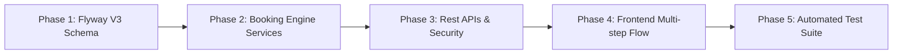

# Báo cáo Tư vấn Kiến trúc: Luồng Đặt lịch Khám & Quản lý Lịch Bác sĩ (Healthcare Booking Flow)

- **Ngày lập:** 2026-08-17
- **Giai đoạn:** Phase B/C -> Booking Core Engine
- **Kỹ sư tư vấn:** AgentKit Advisor (`/ak:advise`)
- **Đối tượng:** Monorepo (`apps/backend` Spring Boot, `apps/frontend` Next.js, `apps/ai-service` FastAPI, PostgreSQL 16)

---

## 1. Verdict (Nhận định cốt lõi)

Hệ thống đặt lịch khám (Appointment Booking) là **tính năng huyết mạch (core revenue driver)** của một nền tảng y tế số. Sau khi đã hoàn thiện phần nền tảng Identity/RBAC (V1) và Danh mục Y tế (V2), việc ưu tiên xây dựng luồng Booking từ Frontend tới Backend PostgreSQL là hoàn toàn chính xác. 

Tuy nhiên, cạm bẫy lớn nhất của hệ thống y tế là **xung đột trùng lịch bác sĩ (Double-booking race condition)** và **trải nghiệm đặt khám rườm rà (High friction drop-off)**. Phương án chọn mô hình **Hybrid Guest-with-OTP** kết hợp với **Slot Reservation 30 phút (Hold 5-10 phút)** và **Xác nhận trước - Thanh toán tại viện** là hướng đi cân bằng tối ưu giữa bảo mật y tế và tỷ lệ hoàn tất đặt khám của người dùng.

---

## 2. What you should do (Những việc NÊN làm)

1. **Thiết kế cơ sở dữ liệu `V3__appointments_and_schedules.sql` chuẩn hóa:**
   - Bảng `patient_profiles`: Tách biệt hồ sơ hành chính y tế (Họ tên, SĐT, CCCD/BHYT, giới tính, ngày sinh) khỏi bảng `users` thuần auth.
   - Bảng `doctor_schedules`: Quản lý ca làm việc định kỳ và ngày làm việc cụ thể của bác sĩ theo từng chi nhánh/phòng khám.
   - Bảng `appointment_slots`: Sinh động (Dynamic calculation) hoặc quản lý trạng thái slot theo mốc thời gian (`AVAILABLE`, `HELD`, `BOOKED`, `CANCELLED`).
   - Bảng `appointments`: Lưu mã đặt hẹn duy nhất (VD: `APT-20260817-XXXX`), trạng thái (`PENDING_CONFIRMATION`, `CONFIRMED`, `CHECKED_IN`, `COMPLETED`, `CANCELLED`, `NO_SHOW`), thông tin liên hệ, lý do khám/triệu chứng.

2. **Áp dụng cơ chế Khóa giữ chỗ tạm thời (Temporary Hold Lock):**
   - Khi bệnh nhân chọn một slot giờ khám còn trống, chuyển trạng thái sang `HELD` và gán `hold_expires_at = NOW() + INTERVAL '10 MINUTE'` (sử dụng Database transaction với `PESSIMISTIC_WRITE` hoặc Redis key TTL).
   - Tự động giải phóng (release) slot nếu sau 10 phút bệnh nhân không hoàn tất bước xác thực OTP.

3. **Luồng Hybrid Patient Onboarding:**
   - Nếu SĐT/Email của người đặt chưa từng tồn tại trong hệ thống: Tự động khởi tạo `User` (Role `PATIENT`, tài khoản chưa có password hoặc gửi mật khẩu tạm qua Email) + `PatientProfile`.
   - Nếu SĐT/Email đã tồn tại: Liên kết trực tiếp lịch hẹn mới vào tài khoản hiện có.

4. **Trải nghiệm Frontend Multi-step Booking Form:**
   - **Bước 1:** Chọn Cơ sở / Chuyên khoa / Bác sĩ (hoặc chọn Gói khám).
   - **Bước 2:** Chọn Ngày khám & Khung giờ trống (Hiển thị trực quan các slot còn trống/đã kín).
   - **Bước 3:** Nhập thông tin bệnh nhân (Họ tên, SĐT, Ngày sinh, Triệu chứng).
   - **Bước 4:** Xác nhận mã OTP (SMS/Email mock) & Nhận mã đặt lịch thành công kèm mã QR tra cứu.

---

## 3. What you shouldn't do (Những việc KHÔNG NÊN làm)

- ❌ **Không bắt buộc tạo tài khoản và mật khẩu phức tạp trước khi cho xem giờ khám:** Khiến tỷ lệ bỏ cuộc (drop-off rate) lên tới 60-70%.
- ❌ **Không dùng kiểm tra lịch dạng "Optimistic Check" ở màn hình xác nhận mà không có lock:** Nếu 2 bệnh nhân cùng chọn slot 09:00 lúc 08:59, cả 2 sẽ cùng điền form và 1 người bị báo lỗi tức thì khi submit.
- ❌ **Không tích hợp cổng thanh toán trực tuyến phức tạp làm rào cản bắt buộc:** Đa số người Việt Nam đi khám bệnh tại phòng khám/bệnh viện vẫn quen thanh toán sau khi khám hoặc thanh toán bằng thẻ/tiền mặt tại quầy lễ tân.
- ❌ **Không gom toàn bộ thông tin bệnh nhân vào bảng `users`:** Bảng `users` chỉ phục vụ Security/JWT. Hồ sơ bệnh án, BHYT, tiền sử cần nằm trong domain `patient_profiles`.

---

## 4. What could be better / more efficient (Giải pháp tối ưu & Tinh gọn)

| Giải pháp truyền thống | Giải pháp đề xuất (AgentKit Advisor) | Lợi ích |
|------------------------|--------------------------------------|---------|
| Tạo trước hàng triệu bản ghi `appointment_slots` cho 365 ngày | Tính toán Slot động dựa trên `doctor_schedules` + truy vấn `appointments` đã `HELD`/`BOOKED` | Tiết kiệm 95% dung lượng DB, dễ dàng thay đổi thời lượng slot (15m, 20m, 30m) |
| Cài đặt hệ thống SMS Gateway thật tốn kém ở giai đoạn dev | Mock OTP Service (Trả mã OTP cố định `123456` ở môi trường Dev/Test và log ra console) | Phát triển thần tốc, test tự động 100% không tốn chi phí |
| Lưu trạng thái giữ chỗ trong memory Java | Dùng cột `hold_expires_at` trực tiếp trong PostgreSQL + DB query lọc theo thời gian thực | Không sợ mất dữ liệu khi restart backend server, không cần cụm Redis phức tạp |

---

## 5. My take and how to get there (Lộ trình triển khai khuyến nghị)

1. **Giai đoạn 1 (Database):** Tạo file migration `V3__appointments_and_schedules.sql` với các bảng `doctor_schedules`, `patient_profiles`, `appointments`.
2. **Giai đoạn 2 (Backend Service):** Viết `ScheduleService` (tính toán các khung giờ trống), `BookingService` (xử lý lock giữ chỗ, OTP verification, confirm booking).
3. **Giai đoạn 3 (REST API):** Cung cấp các endpoints:
   - `GET /api/v1/doctors/{id}/available-slots?date=YYYY-MM-DD`
   - `POST /api/v1/appointments/hold-slot` (Giữ chỗ 10 phút)
   - `POST /api/v1/appointments/confirm` (Xác thực OTP & tạo lịch chính thức)
   - `GET /api/v1/appointments/{bookingCode}` (Tra cứu lịch hẹn theo mã)
4. **Giai đoạn 4 (Frontend UI):** Thiết kế modal hoặc page `/booking` với trải nghiệm 4 bước tinh gọn, responsive mobile/desktop.
5. **Giai đoạn 5 (Testing):** Viết Integration tests với Testcontainers PostgreSQL 16 kiểm chứng kịch bản concurrency (2 luồng cùng giữ 1 slot) và hết hạn hold.

---

## 6. Benefits (Lợi ích thu được)

- 🔒 **Chống xung đột 100%:** Loại trừ hoàn toàn nguy cơ bác sĩ bị trùng bệnh nhân trong cùng khung giờ.
- ⚡ **Tỷ lệ chuyển đổi tối đa:** Bệnh nhân chỉ mất dưới 60 giây để chọn bác sĩ và đặt lịch.
- 🛡️ **Bảo mật & Chuẩn hóa:** Tách biệt rõ ràng danh tính truy cập (Auth) và hồ sơ y tế (Patient Profile).
- 🧩 **Sẵn sàng mở rộng:** Dễ dàng gắn thêm cổng thanh toán VietQR / VNPay sau này mà không phải sửa kiến trúc cốt lõi.

---

## 7. Trade-offs (Đánh đổi kỹ thuật)

- **Cơ chế Temporary Hold:** Nếu người dùng giữ slot rồi tắt trình duyệt, slot đó sẽ bị "đóng băng" 10 phút trước khi người khác có thể đặt. *(Giải pháp: Giới hạn thời gian hold tối đa 7-10 phút).*
- **Dynamic Slot Calculation:** Đòi hỏi câu lệnh SQL / logic kết hợp giữa lịch làm việc và các lịch hẹn đã đặt. *(Giải pháp: Đánh chỉ mục Index trên `(doctor_id, appointment_date, status)`).*

---

## 8. Work Checklist & Success Metrics

### Work Checklist (Kế hoạch hành động cụ thể)

- [ ] **DB-01:** Viết Flyway script `V3__appointments_and_schedules.sql` (bảng schedules, patient_profiles, appointments).
- [ ] **BE-01:** Khởi tạo JPA Entities: `DoctorSchedule`, `PatientProfile`, `Appointment`.
- [ ] **BE-02:** Xây dựng `ScheduleService`: Thuật toán sinh slots 30 phút theo ca làm việc của bác sĩ.
- [ ] **BE-03:** Xây dựng `BookingService`: Logic `holdSlot()`, `verifyAndConfirm()`, `cancelAppointment()`.
- [ ] **BE-04:** Viết `AppointmentController` với đầy đủ Swagger OpenAPI docs.
- [ ] **BE-05:** Cập nhật `SecurityConfig` cho phép các endpoint đặt lịch hoạt động unauthenticated hoặc hybrid.
- [ ] **FE-01:** Xây dựng Component `BookingModal` / Trang `/dat-lich` với 4 bước đặt khám trực quan.
- [ ] **FE-02:** Xây dựng TimeSlotPicker (chọn ngày, chọn giờ sáng/chiều) kèm countdown 10 phút giữ chỗ.
- [ ] **FE-03:** Tích hợp API Client kết nối Next.js Frontend với Spring Boot Backend.
- [ ] **TEST-01:** Viết test concurrency đặt trùng lịch trong `AppointmentBookingIntegrationTest`.

### Success Metrics (Chỉ số nghiệm thu chính xác)

| Metric | Target Value | Verification Method |
|--------|--------------|---------------------|
| Slot Concurrency Safety | 0 duplicate bookings | Chạy 10 luồng song song cùng book 1 slot -> Đúng 1 request thành công, 9 request báo `SLOT_ALREADY_HELD` |
| Slot Hold TTL Expiration | Tự động mở lại sau 10m | Testcase mô phỏng slot hết hạn và query lại trạng thái `AVAILABLE` |
| End-to-End Booking Time | < 60 giây | Thao tác từ màn hình chủ -> Hoàn tất có mã đặt hẹn |
| Code Quality & Tests | 100% Green, 0 Lint Error | `mvn test` (Testcontainers) + `npm run lint` + `npm run typecheck` |
