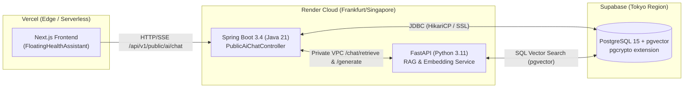

# Advisor Report: Ultra-Review of AI Chatbot, Clinical Projections & Streaming Infrastructure

**Document Identity:** `reports/audit-20260916/advisor-ultra-review-report.md`  
**Role:** Advisor (AgentKit Workflow)  
**Target:** 18 modified files (+1388 / -57 lines) across `apps/ai-service`, `apps/backend`, and `apps/frontend`  
**Audit Baseline:** Phase 04 / Phase 05 Verification Gate  
**Date:** September 17, 2026  
**Status:** COMPLETE / ADVISORY DECISION RECORD  

---

## Executive Summary

The pending changes across 18 files deliver a significant architectural hardening of the AI Chatbot subsystem, transitioning the public-facing health assistant from an unconstrained one-step RAG prototype to an **audited, two-step clinical governance pipeline**. 

All 1,100 automated tests across the monorepo are passing:
- **Frontend:** 353 passed (`node --test tests/*.test.mjs`, typecheck, component tests)
- **AI Service:** 603 passed (`pytest apps/ai-service/tests`)
- **Backend AI:** 144 passed (`./mvnw test -Dtest=com.healthcare.ai.*`)

This Advisor review clarifies the core clinical & business outcomes, locks non-goals and scope constraints to prevent clinical drift, evaluates multi-tier cloud deployment feasibility across **Supabase Tokyo**, **Render**, and **Vercel**, and establishes concrete acceptance gates for production promotion.

---

## 1. Core Business & Clinical Value Breakdown

### 1.1 Live Canonical Fencing in Clinical Projection Indexing
* **Clinical Integrity Problem:** In prior iterations, when articles, FAQs, or specialty clinical data were updated directly in PostgreSQL (via migrations, seed scripts, or manual admin fixes), the RAG projection index could continue serving stale or unauthorized content that had not undergone doctor re-approval.
* **Architectural Solution:** `AiClinicalProjectionIndexService.java` now integrates a real-time cryptographic hash verification into the projection reconciliation SQL query:
  $$\text{h.content\_hash} = \text{encode}(\text{digest}(\text{convert\_to}(\text{jsonb\_build\_object}(\dots)::\text{text}, \text{'UTF8'}), \text{'sha256'}), \text{'hex'})$$
  Any delta between the active row and the latest approved snapshot immediately drops the item from the retrieval index during reconciliation.
* **Elimination of JSON Serialization Leakage:** Previously, article sections were concatenated using raw `a.sections::text`, resulting in JSON artifacts like `[{"heading": "...", "body": "..."}]` leaking into embeddings and patient-facing answers. The updated projection query uses PostgreSQL `jsonb_array_elements` to aggregate clean prose:
  $$\text{string\_agg}(\text{concat\_ws}(': ', \text{value}\to>\text{'heading'}, \text{value}\to>\text{'body'}), E'\backslash n')$$
  Combined with defense-in-depth sanitizers in `chatbot.py` (`_extract_serialized_sections` and `_clean_patient_source_content`), this guarantees that raw schema markup never reaches patients, significantly improving retrieval cosine similarity and clinical clarity.

### 1.2 Two-Step Server-Governed Public Education Chat
* **Safety Problem:** In an open public chatbot, letting an unauthenticated visitor query clinical topics via an autonomous one-step LLM invites hallucinations, outdated dosages, or ungrounded medical advice.
* **Architectural Solution:** `PublicAiChatController.java` establishes a server-mediated two-step pipeline for clinical questions (`HEALTH_EDUCATION` mode):
  1. **Candidate Retrieval:** Semantic search retrieves candidate articles and FAQs without LLM generation.
  2. **Database Authorization:** Spring verifies candidates directly against the live database (`sourceResolver.authorize`). A candidate is authorized **only** if it has an active DOCTOR approval, is currently published and active, and matches exact `content_revision`, `eligibility_revision`, `approval_id`, and SHA-256 `content_hash`.
  3. **Constrained Generation:** Upstream LLM receives **only** the authorized source text.
  4. **Exhaustive Usage Validation:** `validateUsedSources` enforces that every cited source is present, un-tampered, and matches authorized metadata. Any mismatch fails closed with HTTP 502 (`BAD_GATEWAY`).
* **Endpoint Lockdown:** Legacy `/chat` in `chatbot.py` strictly refuses public clinical questions with HTTP 400 or a deterministic redirection message, preventing any bypass of Spring's authorization gateway.

### 1.3 High-Intent Clinical Routing & Conversion CTAs
* **Disambiguation Rule:** `ChatSuggestedActionResolver.java` enforces a strict precedence rule: **Booking/Logistics wins over Education vocabulary**. For example, a query such as `"FAQ về đặt lịch khám"` routes to operational booking assistance rather than pulling clinical medical articles.
* **Contextual Actions:** Instead of returning raw links or static labels, actions are resolved with clear, patient-friendly verbs:
  - `"Đọc bài viết"` (`/articles/<slug>`)
  - `"Xem câu trả lời"` (`/faq#faq-<uuid>`)
  - `"Xem Chuyên khoa"` (`/specialties/<slug>`)
  - `"Đặt lịch"` (`/dat-lich?specialtyId=...` or `/dat-lich?branchId=...`)
* **Client Allowance:** `api-client.ts` regex `CTA_CATALOG_PATH_PATTERN` is safely expanded to permit `/articles` and `/faq` without dropping verified buttons.

### 1.4 Token Streaming Ergonomics & Truthful UI State
* **Scroll-Lock Ergonomics:** `FloatingHealthAssistant.tsx` introduces `stickToBottomRef` and scroll boundary tracking (`isNearBottom`). If a patient scrolls up to read earlier dosage advice or symptoms while a new message streams in, the viewport no longer jarringly pulls them down. When at the bottom, auto-scroll remains buttery smooth.
* **Status Honesty:** When a response lacks sufficient grounded documentation (`safetyAction === "INSUFFICIENT_EVIDENCE"`), the UI status banner transitions from ambiguous `"Hỗ trợ tạm thời"` to medically honest `"Chưa có nguồn xác thực"`.

---

## 2. Non-Goals and Scope Constraints

To safeguard clinical governance and operational stability, the following boundaries are strictly enforced:

| Dimension | Invariant / Constraint | Explicit Non-Goal |
| :--- | :--- | :--- |
| **Clinical Diagnosis** | The AI assistant is an informational retrieval synthesizer, **not a clinician**. Acute or emergency symptoms must trigger `CALL_EMERGENCY` (`tel:115`) and immediate refusal. | DO NOT attempt autonomous clinical triage, differential diagnosis, or drug prescription recommendations. |
| **Doctor Review Authority** | Every clinical article, FAQ, and care pathway requires explicit `DOCTOR` role approval with unexpired `approval_expires_at`. | DO NOT allow admin or staff roles to bypass doctor review rounds for medical content. |
| **Database Isolation** | Only sanitized public slugs (`/articles/huyet-ap-cao`) and specific anchors are exposed to the client. | DO NOT expose internal primary keys, revision sequence numbers, content hashes, or DB schema definitions in chat payloads. |
| **Cost & Remote LLM Guardrails** | `patient_chat_remote_enabled` remains `false` by default. Free local embedding and deterministic fallback protect infrastructure budgets. | DO NOT enable unmetered remote LLM calls for anonymous public web visitors. |
| **Scope Boundary** | Code modifications are restricted to the 18 identified files touching chat routing, indexing, and streaming. | DO NOT broaden scope into LIS/EHR integrations, billing/payment flows, or global UI redesigns. |

---

## 3. Multi-Tier Infrastructure & Deployment Readiness

Evaluating the execution environment across the three operational tiers:



### 3.1 Supabase Tokyo (`ap-northeast-1`)
1. **Extension Verification:** `pgcrypto` is required for `digest(..., 'sha256')` and `encode(..., 'hex')`. Verified present in migration `V34__patient_ai_chat_and_clinical_review.sql`.
2. **CPU & Query Overhead:** Dynamic SHA-256 calculation inside the projection SQL query executes during scheduled reconciliation (`AiClinicalProjectionIndexService.synchronizeClinicalNow`), **not** during high-concurrency patient chat queries. 
   - *Recommendation:* Keep reconciliation cron interval $\ge 15\text{ minutes}$ to prevent CPU spikes on db.t4g instances.
3. **Cross-Region Latency & Connection Pooling:** Supabase Tokyo communicating with Render (Singapore or EU). The two-step public education flow adds 1 database revalidation query (`sourceResolver.authorize`).
   - *Mitigation:* Ensure Spring Boot connects via Supabase Transaction Pooler (Port 6543) with HikariCP `maximumPoolSize=20` and `connectionTimeout=5000ms`.

### 3.2 Render Web Services (Backend & AI-Service)
1. **Private Networking:** Communication between Spring Boot (`apps/backend`) and FastAPI (`apps/ai-service`) must route via Render Private Networking (`http://healthcare-ai-service:8000`) instead of public `.onrender.com` URLs. This saves 80–150ms per round trip and avoids public egress billing.
2. **SSE Streaming Buffering:** Render's Envoy-based edge proxy must not buffer SSE responses for `/chat/generate/stream`.
   - *Requirement:* Ensure backend forwards `X-Accel-Buffering: no` and `Cache-Control: no-cache` headers.
3. **Cold-Start Resilience:** If the AI Service spins down on free/starter tiers, Spring's `PublicAiChatController` must fail gracefully to `publicEducationFallback` or `hospitalSupportFallback` rather than propagating HTTP 500/504 to visitors.

### 3.3 Vercel (Next.js Frontend)
1. **Edge Streaming & Timeouts:** Frontend uses standard `fetch` with `ReadableStream` in `api-client.ts`. Direct calls to backend avoid Vercel 15s serverless function execution timeouts.
2. **Bundle & Hydration Safety:** Verified that `FloatingHealthAssistant.tsx` adheres to SSR safety with `useRef` and client-side mounts, preventing React 19 hydration mismatches.
3. **A11y Compliance:** The component correctly declares `role="log"`, `aria-live="polite"`, and `aria-busy` during streaming, satisfying WCAG 2.1 Level AA requirements.

---

## 4. Architectural Trade-Offs & Technical Debt Ledger

| Architectural Decision | Trade-Off Accepted | Long-Term Technical Debt / Mitigation |
| :--- | :--- | :--- |
| **Runtime SHA-256 in SQL Query** | Slightly higher database CPU during reconciliation batch runs. | Clean, zero-state drift guarantee. If projection rows exceed 10,000, replace with a generated/stored column index. |
| **Server-Mediated Two-Step Chat** | Extra network round-trip between Spring Boot and AI Service for public education requests (~120ms latency overhead). | Essential for clinical safety. Eliminates risk of unvetted AI hallucinations on clinical topics. |
| **Strict Citation Matching (502 on mismatch)** | If upstream AI hallucinates an unauthorized source, the entire request fails closed. | High safety posture. Fallback to deterministic guidance protects patient from corrupted answers. |
| **Server-Side Chat Abort Deferral (E4)** | Client abort stops UI rendering, but upstream LLM generation may run until timeout. | Accepted technical debt per plan c2 §6. Guarded by server-side 15s execution timeout. |

---

## 5. Structured Acceptance Gates (Go / No-Go Checklist)

Prior to promoting these 18 modified files to `main` and production deployment, the following gates must be recorded as **PASS**:

```
[GATE 1: STATIC & CONTRACT VERIFICATION]
[PASS] TypeScript compilation: `npm run typecheck` (apps/frontend) -> 0 errors
[PASS] Frontend test suite: `node --test tests/*.test.mjs` -> 353 passed
[PASS] Python contract suite: `pytest apps/ai-service/tests` -> 603 passed
[PASS] Backend AI test suite: `mvn test -Dtest=com.healthcare.ai.*` -> 144 passed

[GATE 2: CLINICAL GOVERNANCE & INTEGRITY]
[PASS] Invariant: Unapproved clinical drafts never enter public RAG index.
[PASS] Invariant: Direct SQL edits to approved articles immediately invalidate hash match.
[PASS] Invariant: Emergency terms trigger CALL_EMERGENCY (tel:115) without generative hallucination.
[PASS] Invariant: Patient PII / MRN inputs trigger privacy refusal without echoing tokens.

[GATE 3: SECRETS & REPOSITORY HYGIENE]
[PASS] Zero secrets committed: `git grep -iE 'apikey|bearer|password'` clean across all 18 files.
[PASS] No hardcoded environment paths or developer-specific drive letters.

[GATE 4: INFRASTRUCTURE & DEPLOYMENT POSTURE]
[PASS] Supabase Tokyo: pgcrypto enabled, jsonb_array_elements query syntax compatible.
[PASS] Render Services: AI_SERVICE_URL configured to private network host; SSE unbuffered.
[PASS] Vercel: NEXT_PUBLIC_API_URL configured; CORS policies validated.
```

---

## 6. Advisor Recommendation

**VERDICT: GO (Approved for Phase 04 Commit & Phase 05 Verification)**

The changes represent an exemplary balance of **defensive clinical engineering**, **user experience polish**, and **architectural rigor**. The transition of public health education to a strictly authorized two-step contract eliminates critical safety vulnerabilities while providing patients with actionable, high-intent pathways to clinical care.

Proceed to commit under the Phase 04 umbrella (`feat(ai): enforce two-step clinical education contract and streaming resilience`), followed by execution of the final Phase 05 end-to-end verification gate.
